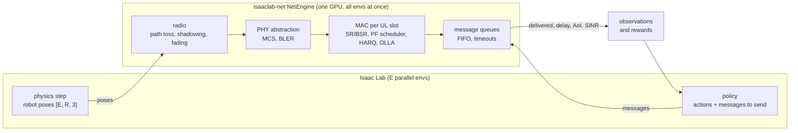

<div align="center">

<h1>isaaclab-net</h1>

<p><b>GPU-batched 5G network simulation for massively parallel robot learning: thousands of Isaac Lab environments, tens to hundreds of robots per cell, one GPU, network state stepped in lockstep with physics.</b></p>

<p>
  <a href="https://www.python.org/"></a>
  <a href="https://pytorch.org/"></a>
  <a href="https://triton-lang.org/"></a>
  <a href="https://isaac-sim.github.io/IsaacLab/"></a>
  <a href="https://github.com/ZzZTripleZzZ/isaaclab-net/actions/workflows/ci.yml"></a>
  <a href="LICENSE"></a>
  
</p>

</div>



Parallel robot learning runs thousands of environments on one GPU, but the network between robots and the edge is usually reduced to a fixed or random delay, if it is modeled at all. Packet-level simulators such as ns-3 capture scheduling, retransmissions and contention, but they run one scenario at a time on a CPU, far from the throughput an RL loop needs. `isaaclab-net` closes that gap. Every piece of network state, from each robot's channel and HARQ process to its queued messages, is a fixed-shape tensor with leading dimensions `[envs, robots]`. The engine advances all environments' uplinks slot by slot on the GPU, in lockstep with the physics. A policy therefore trains against queues that build up when the team transmits together, links that degrade as robots move, and retransmissions that stretch delay tails.

**Status.** Early prototype. The slot-level engine and its fast backends run and are tested for equivalence. The Isaac Lab integration is a skeleton, and restructuring into the `isaaclab_net` package described in [ARCHITECTURE.md](ARCHITECTURE.md) is the next milestone.

## Install

```bash
git clone git@github.com:ZzZTripleZzZ/isaaclab-net.git && cd isaaclab-net
uv venv --python 3.11 && uv pip install torch numpy     # CUDA build of PyTorch; Triton ships with it on Linux
export PYTHONPATH=$PWD/prototype:$PWD/prototype/fast
```

Linux with an NVIDIA GPU. The eager reference engine also runs on a CPU.

## Put a network in your environment

```python
import torch
from netsim import Radio
from netsim_fast import make_net_fast

E, R, dev = 256, 16, torch.device("cuda")          # 256 envs, 16 robots each
net = make_net_fast("L2", E, R, dev, sizes=(4000.0, 30000.0), backend="graph")
radio = Radio(E, dev)                               # per-env shadowing map, gNB at the origin
pos = torch.rand(E, R, 2, device=dev) * 150         # robot positions from your simulator
last = torch.full((E, R), -1, dtype=torch.long, device=dev)
tag = torch.zeros(E, R, dtype=torch.bool, device=dev)
hid = torch.zeros(E, dtype=torch.long, device=dev)

for t in range(300):                                # one control step = 100 ms = 40 uplink slots
    snr = radio.snr_db(pos)
    send = (torch.rand(E, R, device=dev) < 0.3).long()   # per robot: 0 nothing, 1 small frame, 2 large frame
    net.add_frames(t, send, tag, hid, snr)
    newest, _ = net.step(t, snr, hid)               # capture step of the newest frame delivered this step, -1 if none
    last = torch.maximum(last, newest)
    aoi = t + 1 - last                              # age of the freshest delivered frame, in control steps
    queued = net.queued()                           # frames still waiting per robot
    pos = (pos + 0.3 * torch.randn_like(pos)).clamp(0, 150)
```

`aoi` and `queued` go straight into observations. The `tag` and `hid` arguments carry an application flag through the network with each frame; the example task in `prototype/env.py` uses them to mark frames that captured a hazard. [`prototype/isaac/isaac_env_skeleton.py`](prototype/isaac/isaac_env_skeleton.py) shows where these calls sit in an Isaac Lab `DirectRLEnv`.

## What the engine models

| Layer | Mechanism in the slot-level model (`L2`) |
|:---|:---|
| Radio | log-distance path loss, spatially correlated shadowing per env, correlated Rayleigh fading per subband |
| Frame structure | TDD `DDDSU` at 30 kHz SCS, 40 uplink slots per 100 ms control step, 5 subbands of 10 PRBs |
| Access | scheduling request, grant delay, buffer status reports |
| Scheduling | proportional fair over subbands, uplink power split with a power-headroom cap |
| Link | outer-loop link adaptation, one transport block per robot per slot, BLER on effective SINR |
| Retransmission | HARQ with chase-combining gain and a retransmission limit |
| Application | per-robot FIFO of frames, in-order completion, 2 s application timeout |

Configurable numerology, 3GPP MCS/TBS and BLER tables, multiple HARQ processes, downlink, and multi-cell interference with handover are in development. See the roadmap below.

## Fidelity levels

Every level exposes the same API, so a task switches fidelity by changing one argument.

| Level | Model | Typical use |
|:---|:---|:---|
| `L0` | i.i.d. lognormal delay and loss | the usual randomized-delay baseline |
| `L0DR` | `L0` with per-episode randomized delay and loss | domain randomization |
| `L05`, `L05Q` | lookup tables fitted offline from `L2` rollouts | cheap state-conditioned delay |
| `L1` | fluid slot model with equal PRB shares and FIFO queues | contention without MAC detail |
| `L2` | slot-level MAC and PHY (table above) | the reference model |

## Backends and speed

`L2` has three implementations behind one API. `eager` is the readable reference in `prototype/netsim.py`. `graph` records the same operations once as a CUDA graph and is **bitwise identical** to the reference, checked on per-frame finish times and every queue and MAC state across 300 steps at 16×16, 256×16 and 64×100. `triton` runs all 40 slots of a control step in one fused kernel. It matches the reference to rounding: about 3 differing discrete decisions per million robot-steps, with aggregate delivery and delay equal to four significant digits.

Network step time in ms, on an RTX 4090 that other jobs kept 95–99% busy:

| envs × robots | eager | graph | triton |
|---:|---:|---:|---:|
| 256 × 16 | 1,478 | 54.6 | 2.0 |
| 4,096 × 100 | 1,586 | 818 | 60 |

On a quieter GPU, 256 × 16 took 13.4 ms with `graph` and 0.43 ms with `triton`. At these speeds the environment's own operations, not the network, dominate a full training step. `python prototype/fast/test_equiv.py` and `python prototype/fast/bench.py` reproduce both results, and `pytest -m gpu` runs the equivalence checks as tests.

## Validation against ns-3

The reference simulator is ns-3.48 with 5G-LENA NR v5.1, used unmodified except for a documented crash guard that does not change behavior. A 186-run sweep over 1 to 64 UEs, two frame sizes and 13–160% offered load is complete. Aligning the engine's configuration to it (the same per-UE link budgets, BLER tables and HARQ settings) is in progress, and the comparison of delay distributions, throughput, HARQ statistics and PRB use will be added here. Co-simulation bridges to ns-3 (lockstep, process pool and offline replay) are under construction for closed-loop checks. They are for validation only and are never needed for training.

## Roadmap

- [x] Slot-level uplink engine (`L2`) and lower fidelity levels
- [x] `graph` backend, bitwise equal to the reference, and `triton` backend for scale
- [ ] Package layout `isaaclab_net/` (core, isaac, bridges, examples) per [ARCHITECTURE.md](ARCHITECTURE.md)
- [ ] Partial resets per env and per-env clocks for Isaac Lab
- [ ] Configurable NR: numerology, TDD patterns, 3GPP MCS/TBS and BLER tables, multiple HARQ processes, downlink
- [ ] Multi-cell interference and handover
- [ ] Isaac Lab 3.0 integration, demo tasks and scaling benchmarks
- [ ] Validation against ns-3 5G-LENA and public measurement traces
- [x] Test suite (67 CPU tests, GPU equivalence tests) and CI

## Repository layout

```
isaaclab-net/
├── prototype/
│   ├── netsim.py                 # eager reference engine: radio, frame queues, fidelity levels L0 ... L2
│   ├── env.py                    # example task: robot fleet offloading hazard detection over a shared uplink
│   ├── fast/
│   │   ├── netsim_fast.py        #   graph and triton backends of L2, same API
│   │   ├── triton_slot.py        #   the fused per-step kernel
│   │   ├── test_equiv.py         #   equivalence against the reference under identical random draws
│   │   └── bench.py bench_env.py #   network-only and full-env benchmarks
│   └── isaac/
│       ├── netmodule.py                  # backend-agnostic NetModule API with partial resets (skeleton)
│       ├── isaac_env_skeleton.py         # hooks into an Isaac Lab DirectRLEnv (not yet run)
│       └── maniskill_adapter_skeleton.py # the same module in ManiSkill3 (not yet run)
├── ARCHITECTURE.md               # target package layout and interface contract
├── CONTRIBUTING.md
└── LICENSE
```

## Contributing

The repository is private while the first paper is in preparation. Collaborators should start from [CONTRIBUTING.md](CONTRIBUTING.md) and the open roadmap items. Changes to `L2` go into the eager reference first, and the `graph` backend must stay bitwise equal to it.

## Citation

A paper describing the engine is in preparation. A citation and an arXiv link will be added on release.

## License

BSD-3-Clause, see [LICENSE](LICENSE).
