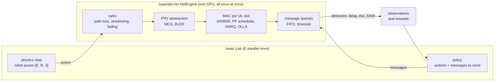

<div align="center">

<h1>isaaclab-net</h1>

<p><b>GPU-batched 5G network simulation for massively parallel robot learning: thousands of Isaac Lab environments, tens to hundreds of robots per cell, one GPU, network state stepped in lockstep with physics.</b></p>

<p>
  <a href="https://www.python.org/"></a>
  <a href="https://pytorch.org/"></a>
  <a href="https://triton-lang.org/"></a>
  <a href="https://isaac-sim.github.io/IsaacLab/"></a>
  <a href="https://github.com/ZzZTripleZzZ/isaaclab-net/actions/workflows/ci.yml"></a>
  <a href="LICENSE"></a>
  
</p>

</div>



Parallel robot learning runs thousands of environments on one GPU, but the network between robots and the edge is usually reduced to a fixed or random delay, if it is modeled at all. Packet-level simulators such as ns-3 capture scheduling, retransmissions and contention, but they run one scenario at a time on a CPU, far from the throughput an RL loop needs. `isaaclab-net` closes that gap. Every piece of network state, from each robot's channel and HARQ process to its queued messages, is a fixed-shape tensor with leading dimensions `[envs, robots]`. The engine advances all environments' uplinks slot by slot on the GPU, in lockstep with the physics. A policy therefore trains against queues that build up when the team transmits together, links that degrade as robots move, and retransmissions that stretch delay tails.

**Status.** Early prototype, now packaged as `isaaclab_net`. The prototype levels and their fast backends are tested for bitwise equivalence, the configurable NR engine (3GPP MCS/TBS and BLER tables, multiple HARQ processes, downlink, multiple cells) and the legacy multi-cell uplink are merged behind one engine factory, the Isaac Lab layer runs every level through the same factory, and the ns-3 bridges are in the package. The Isaac Lab fleet demo trains end to end with the network in the loop; its uncontended scaling benchmarks are still to be run. [ARCHITECTURE.md](ARCHITECTURE.md) lists the status of every module.

## Install

```bash
git clone git@github.com:ZzZTripleZzZ/isaaclab-net.git && cd isaaclab-net
uv venv --python 3.11 && source .venv/bin/activate
uv pip install torch                                # CUDA build of PyTorch; Triton ships with it on Linux
uv pip install -e ".[dev]"                          # the isaaclab_net package, plus pytest and ruff
```

Linux with an NVIDIA GPU. The reference engines also run on a CPU. Scripts in `prototype/` still work: they are thin shims over the package.

## Put a network in your environment

```python
import torch
from isaaclab_net import NRConfig, Requests, make_engine

E, R, dev = 256, 16, torch.device("cuda")          # 256 envs, 16 robots each
net = make_engine("L2-legacy", E, R, dev, backend="graph")    # slot-level uplink, CUDA-graph backend
pos = torch.rand(E, R, 2, device=dev) * 150         # robot positions from your simulator ([E,R,3] also works)
last = torch.full((E, R), -1, dtype=torch.long, device=dev)

for _ in range(300):                                # one control step = 100 ms = 40 uplink slots
    send = (torch.rand(E, R, device=dev) < 0.3).long()   # per robot: 0 nothing, 1 small frame, 2 large frame
    net.submit(None, Requests(send))                # None = each env's own clock net.clock [E]
    out = net.step(None, pos)                       # positions go through the engine's radio; an SNR [E,R] also works
    last = torch.maximum(last, out["newest"])       # capture step of the newest frame delivered, -1 if none
    aoi = out["t"][:, None] + 1 - last              # age of the freshest delivered frame, in control steps
    queued = out["queue_len"]                       # frames still waiting per robot
    pos = (pos + 0.3 * torch.randn_like(pos)).clamp(0, 150)
    done = torch.nonzero(torch.rand(E, device=dev) < 0.005).squeeze(-1)   # envs whose episode ended
    net.reset(done)                                 # partial reset: queues, MAC, fading, radio and clock of these envs
    last[done] = -1
```

`make_engine(level, E, R, device, config, backend)` builds every fidelity level, and every engine has the same API. `step` also returns, per message slot, the `delivered` and `timed_out` masks, the `delay` in control steps and the `cap`/`cls` of each message, plus `queue_bytes`, `sinr_db` and, if `Requests(send, det, hid)` carried an application tag, `det_env`. `reset(env_ids)` takes an index tensor, a list or a bool mask and leaves every other env bit-for-bit unaffected. The earlier calls `add_frames(t, send, det, hid, snr)` and `step(t, snr, hid) -> (newest, det_env)` still work. `aoi` and `queued` go straight into observations. The example task in [`isaaclab_net/examples/fleet_task.py`](isaaclab_net/examples/fleet_task.py) uses the application tag to mark frames that captured a hazard. [`isaaclab_net/isaac/mixins.py`](isaaclab_net/isaac/mixins.py) wires a network into an Isaac Lab `DirectRLEnv` with four hook calls (see [Isaac Lab quick start](#isaac-lab-quick-start)).

## Isaac Lab quick start

Tested natively on Windows 11 with an RTX 4090 (driver 617.14; the CUDA 13.0 build of PyTorch needs 580.88 or newer):

| Component | Version |
|:---|:---|
| Isaac Sim | 6.1.0.0 (pip wheels from pypi.nvidia.com) |
| Isaac Lab | 3.0 (`release/3.0.0`, package `isaaclab` 25.0.0; Isaac Sim 5.1 and older are not supported) |
| Python | 3.12 (uv venv) |
| PyTorch | 2.12.0+cu130, torchvision 0.27.0 |
| Triton | `triton-windows` 3.8.0.post29 (community build, only for the `triton` backend) |
| RL library | `rsl-rl-lib` 5.5.1 (installed by `isaaclab.bat -i`) |

**Install Isaac Sim and Isaac Lab.** The scripts in `scripts/windows/` follow the Isaac Lab 3.0 page "Python environment with Isaac Sim" (Windows, uv) and keep everything under `C:\isaac5g`. Run them from an Administrator PowerShell in the repository folder:

```powershell
New-Item -ItemType Directory -Force C:\isaac5g | Out-Null
Copy-Item scripts\windows\env.ps1 C:\isaac5g\env.ps1      # venv, uv, caches and EULA flag for every later step
powershell -File scripts\windows\01_bootstrap.ps1          # long paths on, uv and portable git in C:\isaac5g\tools
powershell -File scripts\windows\02_install_isaacsim.ps1   # venv, isaacsim[all,extscache]==6.1.0.0, torch 2.12 cu130, Isaac Lab clone
powershell -File scripts\windows\03_install_isaaclab.ps1   # isaaclab.bat -i: Isaac Lab and its RL libraries
powershell -File scripts\windows\04_triton_windows.ps1     # triton-windows, for the triton backend
```

`env.ps1` sets `OMNI_KIT_ACCEPT_EULA=YES`, which accepts the NVIDIA Omniverse EULA; read it before you run the scripts. It also moves the per-user caches (Kit, Triton, uv, temp) into `C:\isaac5g\home`. The download is about 40 GB and the install takes about 15 minutes.

**Add the package and run the tests, a benchmark and a short training run:**

```powershell
. C:\isaac5g\env.ps1                                       # activates the Isaac venv
cd C:\isaac5g\isaaclab-net                                 # this repository
uv pip install --no-deps -e .                              # --no-deps keeps Isaac's CUDA build of torch
uv pip install pytest
python -m pytest -m isaac tests\test_isaac_env.py
python benchmarks\isaac\bench.py --num_envs 256 --num_robots 16 --level L2-legacy --backend triton --steps 100
python benchmarks\isaac\train_ppo.py --num_envs 256 --num_robots 16 --level L2-legacy --backend triton --iters 5
```

Isaac Lab 3.0 runs headless by default. The Isaac tests launch one Isaac Sim process per case and take about 1 minute each. On a machine where nobody is logged on at the console, CUDA is available only to jobs that run as SYSTEM: `scripts\windows\systask.ps1` runs a script as a one-shot SYSTEM task, and `scripts\windows\wait.ps1` waits for it and removes the task.

**Add the network to your DirectRLEnv.** `NetEnvMixin` wires a `NetModule` into four hooks. The network is configured by the same `NRConfig` that `make_engine` takes, and a small `IsaacNetCfg` adds the Isaac-side settings: where the poses come from, the network rate, blockage, domain randomization and the observation features. Frames are captured at the start-of-step pose, and the network step takes the end-of-step poses:

```python
from isaaclab.envs import DirectRLEnv
from isaaclab_net import NRConfig
from isaaclab_net.isaac import IsaacNetCfg, NetEnvMixin

NR = NRConfig(msg_sizes=(4000.0, 30000.0))                  # the network: one config, as for make_engine
ISAAC = IsaacNetCfg(pose_asset="robots",                     # poses from the scene's "robots" collection
                    obs_features=("aoi", "sinr", "queue_len", "delay_history"),
                    dr_ranges={"noise_dbm": (-95.0, -85.0), "shadow_sigma_db": (3.0, 9.0)})
# env cfg: observation_space = R * (task features + ISAAC.obs_dim(NR))

class MyFleetEnv(NetEnvMixin, DirectRLEnv):
    def _setup_scene(self):
        ...                                                  # self.scene["robots"]: a RigidObjectCollection of R robots
        self.net_setup("L2-legacy", R, NR, "triton", isaac=ISAAC)
    def _pre_physics_step(self, actions):
        ...                                                  # read the start-of-step pose, decide what to send
        self.send = choose_messages(actions)                 # [E,R] long: 0 nothing, 1 small, 2 large message
    def _get_dones(self):
        out = self.net_step(None, self.send)                 # end-of-step poses from "robots"; newest_cap, aoi_s, ...
        ...
    def _reset_idx(self, env_ids):
        super()._reset_idx(env_ids); ...; self.net_reset(env_ids)   # also redraws the dr_ranges of env_ids
    def _get_observations(self):
        net = self.net_obs()                                 # [E,R,ISAAC.obs_dim(NR)] normalized network features
        ...
```

`net_setup` takes any level of `make_engine` (`"off"` for an ideal link), an `NRConfig`, a backend and an `IsaacNetCfg`. The observation features are chosen from the delivered mask and the delay of each message slot, age of information, queue length and bytes, SINR and RSRP, the serving cell, a last-delivery flag, the delays of the last k delivered messages, and a blockage flag, all with one normalization. The domain-randomization ranges cover the radio (transmit power, noise floor, path loss, shadowing sigma, blockage loss), the gNB placement, and the delay and loss of L0 and L0DR, and `dr_support(level)` tells which of them a level honors. `net_decimation` and `net_substeps` run the network slower or faster than the env step. `net_step(pos, send, tag, cur_tag)` also carries a per-message tag, such as the id of the hazard a frame captured, and returns `tag_delivered` per env. The fields, the feature table and the randomization table are in [docs/isaac-lab.md](docs/isaac-lab.md#configuring-the-network). The earlier `NetConfig` is a deprecated alias. [`isaac_fleet_env.py`](isaaclab_net/examples/isaac_fleet_env.py) is the complete example: E envs × R robots in a 150 m arena, with hazards that the whole fleet learns about only when a detection frame is delivered.

**Scale.** These numbers come from the fleet env with random actions, which saturate the uplink from 16 robots per env. They were measured on 2026-09-29, before the Isaac layer was rebuilt on `make_engine`, with the same L2-legacy model and Triton kernel. The RTX 4090 was shared with other jobs that kept it 98–99% busy the whole time. Treat the absolute rates as lower bounds, and trust the ratios of network on to network off:

| Envs × robots | Robots | Network off (control steps/s) | L2-legacy `triton` (control steps/s) | On / off | Network per step |
|---:|---:|---:|---:|---:|---:|
| 1,024 × 128 | 131,072 | 6.21 | 5.55 | 0.89 | 19 ms |
| 2,048 × 128 | 262,144 | 4.38 | 3.96 | 0.90 | 31 ms |
| 4,096 × 128 | 524,288 | 2.90 | 2.58 | 0.89 | 52 ms |
| 8,192 × 128 | 1,048,576 | 1.40 | 1.27 | 0.91 | 75 ms |

One control step is 0.1 s of simulated time. At about one million robots the network runs in the loop at 1.33 million robot-steps per second in 16.4 GB of device memory. From 131k robots upwards the network costs 9–20% of the step. The `graph` backend replays thousands of small kernels per step, so under time-slicing it is several times slower than `triton`: use `graph` for bitwise-reference runs and `triton` for scale. Startup grows by about 1.1 ms per robot (PhysX cloning), which is 19 minutes at one million robots. End-to-end PPO (rsl_rl, 1,024 × 16, L2-legacy `triton`) ran 30 iterations in 241 s at 53k robot-steps per second.

## Configure the network

One `NRConfig` dataclass configures every module: numerology, carrier and TDD pattern, MAC timing, HARQ and RLC, the PHY tables, the radio and cell layout, and the application fields (frame buffer, timeout, message sizes). The configurable NR engine is level `L2`:

```python
from isaaclab_net import NRConfig, make_engine
from isaaclab_net.core import lena_validation, multicell, netslot_compat, oai_like, srsran_like

cfg = NRConfig(mu=1, bandwidth_mhz=20, tdd_pattern="DDDSU", n_harq=16, mcs_table=2, dl=True)
net = make_engine("L2", E, R, dev, cfg)             # 51 PRB in 13 RBGs, 16 HARQ processes, EESM, uplink + downlink
net.add_dl_frames(None, torch.full((E, R), 3000.0, device=dev))  # downlink bytes per robot; see out["dl_newest"]
net = make_engine("L2", E, R, dev, netslot_compat())                     # closest to the legacy NetSlot
net = make_engine("L2", E, R, dev, multicell(3, dl=True))               # 3 cells: UL + DL interference, handover
out = net.step(None, pos)                           # several cells take poses (or pathgain_db=[E,R,C]); out["serving_cell"]
```

Presets: `netslot_compat()` (the legacy L2 geometry and timing with the 3GPP PHY), `lena_like()` and `lena_validation()` (the ns-3 5G-LENA reference scenario), `srsran_like()` and `oai_like()` (latency fitted to public srsRAN and OAI measurements), and `multicell(n)` (hexagonal cells at 100 m spacing, thermal noise, uplink fractional power control on). Uplink power control is on by default whenever `n_cells > 1`: without it, full-power robots next to their own gNB dominate the interference, and three cells carry less than one. Multi-cell configurations run on `L2` (per-cell schedulers and HARQ, uplink and downlink interference) and on `L2-legacy` (NetSlotMC, uplink only). The NR engine runs on the `reference` backend.

**PHY tables and licensing.** The BLER tables shipped in `isaaclab_net/core/data/` are exported from Sionna SYS 2.2.0 (Apache-2.0, license file alongside). The 5G-LENA tables used by `bler_source="lena"` (the `lena_like` presets) are GPL-2.0 data and are never shipped or committed. Generate them from your own 5G-LENA checkout; the script asks for its location if you omit it:

```bash
git clone https://gitlab.com/cttc-lena/nr.git ~/src/nr
python -m isaaclab_net.tools.extract_lena_tables ~/src/nr   # writes ~/.cache/isaaclab_net/lena_eesm_tables.npz
```

`ISAACLAB_NET_LENA_TABLES` points the engine to another location. Keep the generated file out of any redistribution.

## What the engine models

| Layer | Configurable NR engine (`L2`) | Legacy slot-level model (`L2-legacy`) |
|:---|:---|:---|
| Radio | path loss, spatially correlated shadowing per env and cell, correlated Rayleigh fading per subband and link | the same, one cell at the arena corner by default |
| Frame structure | numerology 0 to 2, any bandwidth (38.101 N_RB), any TDD pattern and special slot, RBGs per 38.214 | TDD `DDDSU` at 30 kHz SCS, 40 uplink slots per 100 ms, 5 subbands of 10 PRBs |
| Access | periodic SR, grant delay, BSR, optional proactive grants | scheduling request, grant delay, buffer status reports |
| Scheduling | proportional fair per RBG (subband or wideband metric), retransmissions first | proportional fair over subbands, power split with a headroom cap |
| Link | 3GPP MCS tables and exact TBS, EESM, BLER-target link adaptation, OLLA, MCS caps | OLLA, one transport block per robot per slot, logistic BLER on effective SINR |
| Retransmission | multiple HARQ processes, chase or IR combining, RLC AM retry or UM loss | HARQ with a chase-combining gain and a retransmission limit |
| Downlink | per-robot gNB queues, delayed and quantized CQI, K1 feedback | none |
| Cells | 1 to 7 cells, a PF scheduler and HARQ per cell, same-slot UL and DL interference, fractional UL power control, A3 handover with interruption | 1 to 7 cells, same-slot UL interference, fractional power control, A3 handover |
| Application | per-robot FIFO, in-order completion, timeout or PDCP discard | per-robot FIFO of frames, in-order completion, 2 s application timeout |

## Fidelity levels

Every level exposes the same API, so a task switches fidelity by changing one argument of `make_engine`.

| Level | Model | Typical use |
|:---|:---|:---|
| `L0` | i.i.d. lognormal delay and loss | the usual randomized-delay baseline |
| `L0DR` | `L0` with per-episode randomized delay and loss | domain randomization |
| `L05`, `L05Q` | lookup tables fitted offline from `L2` rollouts | cheap state-conditioned delay |
| `L1` | fluid slot model with equal PRB shares and FIFO queues | contention without MAC detail |
| `L2` | configurable NR MAC and PHY (table above) | the fidelity model |
| `L2-legacy` | the prototype slot-level MAC and PHY, frozen; multi-cell capable | reproducing the earlier prototype experiments, and speed at scale |
| `TR` | trace replay: each env replays one recorded `L2` env-episode, open loop | the replayed-trace baseline |
| `GE` | 3-state Markov-modulated delay and loss, one chain per env | the Gilbert–Elliott-style baseline |
| `QA` | analytic processor-sharing queue per control step, FIFO service, SR delay | contention without slot simulation |
| `NN` | learned stateful surrogate: MLP drop probability and delay quantiles from send-time features | the learned-surrogate baseline |
| `ORACLE` | every message delivered at capture, delay 0, never lost | upper bound on what any network gives a task |
| `NOCOMM` | no message ever delivered | lower bound: the task without communication |

`TR`, `GE`, `QA` and `NN` are fitted from `L2` or `L2-legacy` rollouts of the example fleet task. The fit writes one parameter file outside the repository, and every engine loads it:

```bash
python -m isaaclab_net.tools.fit_levels --source L2-legacy --task T1 --backend graph   # ~/.cache/isaaclab_net/levels/L2-legacy_T1.pt
```

```python
net = make_engine("NN", E, R, dev, params="~/.cache/isaaclab_net/levels/L2-legacy_T1.pt", backend="graph")
```

`ORACLE` and `NOCOMM` are value-of-information bounds for task design. Run a task under both first: a task in which network fidelity can matter must show a large gap between its `ORACLE` and `NOCOMM` returns. If the gap is small, the policy gains little from what the network delivers, and the task cannot tell fidelity levels apart.

## Backends and speed

Every prototype level (`L0` to `L1`, `L2-legacy`) has a readable eager reference in `isaaclab_net/core/proto/netsim.py` and graph-safe fast versions in `isaaclab_net/core/proto/netsim_fast.py`. `graph` records the same operations once as a CUDA graph and is **bitwise identical** to the reference at every level (per-message outputs, every queue and MAC state, with random partial resets). `triton` (`L1`, `L2-legacy`) runs all 40 slots of a control step in one fused kernel and matches the reference to rounding: from an identical state every finish time agrees, and over long runs aggregate delivery and delay agree to three or four significant digits. `compile` (torch.compile + CUDA graph) also agrees to rounding. The NR engine (`L2`, one or several cells) and the legacy multi-cell engine have only the `reference` backend so far. The surrogate and bound levels (`TR` to `NOCOMM`) are written once with graph-safe ops, so their `reference` backend runs the same operations as `graph`, which is bitwise identical to it. On a shared GPU the NR uplink costs about 2.6–3.9 times the legacy reference per step, and the multi-cell engine about 1.2 times.

Network step time (`submit` + `step`, dict outputs) in ms, on an RTX 4090 that other jobs kept 98–99% busy, so absolute numbers are pessimistic:

| level | 256 × 16 reference | graph | triton | 4,096 × 100 reference | graph | triton |
|:---|---:|---:|---:|---:|---:|---:|
| `L0`, `L0DR` | 10.0–10.3 | 2.1 | | 19.2–19.5 | 45 | |
| `L05`, `L05Q` | 13.5–14.3 | 2.1 | | 21–23 | 46 | |
| `L1` | 118 | 7.3 | 2.1 | 458 | 474 | 48 |
| `L2-legacy` | 769 | 32 | 2.1 | 1,102 | 566 | 71 |

At small sizes every fast backend sits at a ~2 ms floor set by the busy GPU. At 4,096 × 100 the fixed-shape graph versions of the delay levels are memory-bound and slower than the eager reference, which only touches the new and finished frames. Resetting 1% of envs every step adds 0.3–2 ms at 256 × 16. `tests/scripts/test_equiv.py`, `test_reset.py` and `benchmarks/bench.py` reproduce these results, and `pytest -m gpu` runs the equivalence checks as tests.

## Validation against ns-3

The reference simulator is ns-3.48 with 5G-LENA NR v5.1, used unmodified except for a documented crash guard that does not change behavior. A 186-run sweep over 1 to 64 UEs, two frame sizes and 13–160% offered load is complete. Replaying 153 of its runs in the NR engine with the same per-UE link budgets (`lena_validation()`, `python -m isaaclab_net.bridges.ns3_offline.lena_replay`) matches the drop rate to a mean absolute difference of 0.029. The remaining light-load delay offset of about 20 ms is closed by an SR-to-grant delay of 40 slots, which is inferred from the replay and not yet measured in 5G-LENA. The comparison of delay distributions, throughput, HARQ statistics and PRB use will be added here. Co-simulation bridges to ns-3 (lockstep, process pool and offline replay) are in `isaaclab_net/bridges/`, with their C++ ns-3 programs in `isaaclab_net/bridges/ns3/`. They are for validation only and are never needed for training. They need a local ns-3 + 5G-LENA build, which is not part of this package.

## Roadmap

- [x] Slot-level uplink engine and lower fidelity levels
- [x] `graph` backend, bitwise equal to the reference, and `triton` backend for scale
- [x] Package layout `isaaclab_net/` (core, isaac, bridges, examples) per [ARCHITECTURE.md](ARCHITECTURE.md)
- [x] Partial resets per env, per-env clocks and the `submit` / `step` dict API, at every level and backend
- [x] Configurable NR: numerology, TDD patterns, 3GPP MCS/TBS and BLER tables, multiple HARQ processes, downlink
- [ ] `graph` / `triton` backends for the NR engine
- [x] Multi-cell interference and handover (legacy L2)
- [x] Multi-cell MAC in the NR engine (per-cell schedulers and HARQ, uplink and downlink interference, power control, handover)
- [x] Isaac Lab 3.0 integration on the engine API: DirectRLEnv mixin, network domain randomization, fleet demo env, PPO
- [ ] Uncontended Isaac Lab scaling benchmarks and more demo tasks
- [ ] Validation against ns-3 5G-LENA and public measurement traces
- [x] Test suite (CPU tests, GPU equivalence tests) and CI
- [x] Fitted surrogate levels (trace replay, Markov-modulated, analytic queue, learned) and ORACLE / NOCOMM bounds

## Repository layout

```
isaaclab-net/
├── isaaclab_net/
│   ├── core/                     # backend-agnostic engines, no simulator imports
│   │   ├── config.py             #   NRConfig, the one config dataclass, and its presets
│   │   ├── engine.py             #   make_engine(level, ...) and NREngine, the contract API of every level
│   │   ├── nr_engine.py          #   configurable NR engine (L2): slot schedule, fading, UL/DL, partial reset
│   │   ├── phy.py  queues.py     #   3GPP MCS/TBS/BLER/EESM; fixed-shape frame FIFOs on a byte stream
│   │   ├── mac.py mac_ul.py mac_dl.py   # per-slot MAC: multi-HARQ, PF, link adaptation; UL and DL hooks
│   │   ├── radio.py  traffic.py  #   per-link radio, cell association and handover; Requests
│   │   ├── data/                 #   Sionna BLER tables (Apache-2.0)
│   │   ├── proto/                #   prototype levels L0 ... L1 and L2-legacy: reference, fast backends,
│   │   │                         #   Triton kernels, and the multi-cell NetSlotMC
│   │   └── levels/               #   fitted surrogates TR, GE, QA, NN and the ORACLE / NOCOMM bounds
│   ├── isaac/                    # Isaac Lab layer: NetModule on make_engine, radio, DirectRLEnv mixin, mdp terms
│   ├── bridges/                  # ns-3 co-simulation (lockstep, process pool, offline replay), validation only
│   │   └── ns3/                  #   the C++ ns-3 programs and their build scripts
│   ├── examples/                 # fleet_task.py (pure torch), isaac_fleet_env.py (Isaac Lab demo env)
│   └── tools/                    # PHY table export, local 5G-LENA table extraction, surrogate fits (fit_levels)
├── tests/                        # pytest suite; scripts/ (equivalence scripts), bridges/ (need ns-3)
├── benchmarks/                   # engine, NR, multi-cell, Isaac and ns-3 scaling benchmarks
├── prototype/                    # compatibility shims for the old module paths
├── scripts/                      # GPU test runner; windows/: Isaac Sim + Isaac Lab install and SYSTEM-task helpers
├── ARCHITECTURE.md               # package layout, interface contract and module status
├── CONTRIBUTING.md
└── LICENSE
```

## Documentation

Collaborator documentation lives in [`docs/`](docs/README.md): the [project status](docs/STATUS.md) with open items and starter tasks, the [5G-LENA validation](docs/validation-5g-lena.md), the [public-data calibration](docs/calibration-public-data.md), the [real-network measurement protocol](docs/measurement-protocol.md) with its parsers and calibration hooks in `isaaclab_net/tools/measure/`, [performance](docs/performance.md) with the backend equivalence methodology, the [Isaac Lab integration](docs/isaac-lab.md), [multi-cell networks](docs/multicell.md) and the [ns-3 bridges](docs/bridges.md).

## Contributing

The repository is private while the first paper is in preparation. Collaborators should start from [CONTRIBUTING.md](CONTRIBUTING.md) and the open roadmap items. Changes to the prototype levels go into the eager reference first, and the `graph` backend must stay bitwise equal to it. New MAC and PHY modelling goes into the NR engine.

## Citation

A paper describing the engine is in preparation. A citation and an arXiv link will be added on release.

## License

BSD-3-Clause, see [LICENSE](LICENSE). The shipped Sionna tables are Apache-2.0 (`isaaclab_net/core/data/LICENSE-sionna-Apache-2.0`). No ns-3 or 5G-LENA code or data is included.
