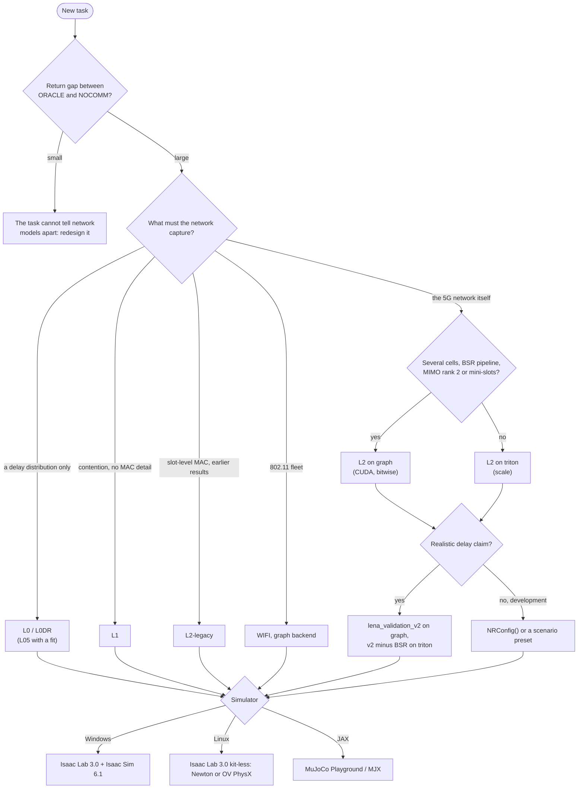

# Choosing a configuration

A run is defined by four choices: the fidelity level (what network model the policy trains against), the backend (how that model is executed), the configuration preset (which network it is), and the robot simulator around it. This page gives the short answer for each, with links to the pages that hold the measurements. The flowchart at the end puts the four together.

All costs below are network-only milliseconds per control step (100 ms of simulated time) on an idle RTX 4090, from [Performance](performance.md#network-cost-per-level-and-backend). Read them as orders of magnitude: your GPU, driver and host will move them, and the [FAQ](faq.md#how-fast-is-it-on-my-gpu) explains how to measure your own.

## Which fidelity level?

Every level has the same API, so a task switches by changing the first argument of `make_engine`. Start from the question your experiment asks, and pick the cheapest level that can still answer it.

| Level | Use it when | Cost at 256 × 16 / 4096 × 100 | What it misses |
|:---|:---|:---|:---|
| `ORACLE`, `NOCOMM` | designing a task: run both first. A small gap between their returns means the task cannot tell network models apart | negligible | everything: they are bounds, not network models |
| `L0` | you need the usual randomized-delay baseline | 0.4 ms (`graph`) / 5 ms (`reference`) | contention: a message's delay does not depend on what other robots send, where the robot is, or how long its queue is |
| `L0DR` | you want delay and loss domain randomization, redrawn per env at every reset | same as `L0` | same as `L0` |
| `L05`, `L05Q` | you want a cheap delay that depends on load and SNR, from tables fitted to `L2` rollouts | 0.4 ms / 5 ms | dynamics outside the fit: the tables know only the load and SNR conditions of the rollouts they were fitted on |
| `L1` | contention matters but MAC detail does not: robots share each slot equally, with FIFO queues | 0.36 ms / 11 ms (`triton`) | scheduling requests, HARQ, link adaptation, proportional-fair scheduling |
| `L2-legacy` | you reproduce the earlier prototype experiments, or need slot-level MAC detail at the largest scale | 0.46 ms / 18 ms (`triton`) | configurability: fixed constants (one TDD pattern, 5 subbands, logistic BLER), no downlink, no 3GPP MCS / TBS tables |
| `L2` | the network model itself is the point: 3GPP tables, HARQ processes, downlink, 1 to 7 cells, QoS, obstacles | 1.7 ms / 68 ms (`triton`, `NRConfig()`); 2.0 / 94 ms in the scale configuration | effects below one slot, beamforming and antenna arrays, per-cluster fading; the default `NRConfig()` is not validated (see [Which preset?](#which-preset)) |
| `WIFI` | the fleet runs on 802.11 instead of private 5G | 34 ms / 0.8 s (`graph`) | slot-level correlations of contention, UL OFDMA and other 802.11ax features, the downlink ([Wi-Fi](wifi.md#what-the-model-drops)) |
| `TR`, `GE`, `QA`, `NN` | you need a fitted baseline from the literature (trace replay, Gilbert–Elliott, analytic queue, learned surrogate) | 0.4–0.5 ms / 11–15 ms (`graph`) | whatever the fit does not capture; `TR` is open loop, so it ignores what the policy sends |
| `L1D`, `QAD` | you need gradients of delay or AoI with respect to send probability, size, power or position | not built by `make_engine` | discrete MAC events; exact only at temperature 0 ([Differentiable models](differentiable.md)) |

Three rules of thumb follow from the table:

- **Train at the fidelity you will report.** A policy that exploits the absence of contention under `L0` can fail under `L2`. If you train at a cheap level for speed, evaluate at `L2` and say so, or mix the two per env with `AdaptiveEngine` ([Adaptive fidelity](adaptive-fidelity.md)).
- **The cost gap closes at small sizes.** Up to a few thousand robots every level except `WIFI` costs about a millisecond per step on its fast backend, which is usually less than the physics. The choice then rests on fidelity alone.
- **`L2` and `L2-legacy` do not agree, by design.** Their default constants differ (for example 16 HARQ processes against one), so compare levels on the same seeds ([Cookbook recipe 4](cookbook.md#4-compare-two-fidelity-levels-on-the-same-seeds)) and treat the difference as part of the result.

## Which backend?

The backend does not change the model, only how it runs. Every fast backend is tested against the readable `reference` of its level ([Concepts](concepts.md#backends-and-the-equivalence-guarantee)).

| Backend | Use it for | Notes |
|:---|:---|:---|
| `reference` | debugging, reading the model, any CPU run | eager PyTorch, slow on a GPU (launch-bound: `L2` costs about 330 ms per step at any small size). Also the faster choice for `L0` to `L05Q` at large R |
| `graph` | scientific runs whose numbers must be reproducible | **bitwise equal** to `reference`, including random partial resets. Needs CUDA for `L2` and `WIFI`. At 4096 × 100 it costs as much as the reference for `L1` and `L2`, so it is not the scale path |
| `triton` | training at scale | one fused kernel per control step, equal to `reference` to float rounding (about 3 discrete flips per million robot-steps). `L1`, `L2-legacy` and single-cell `L2` only |
| `compile` | nothing in training | equal only to rounding, and its finish-time flips bias the mean delay by about 3% ([Performance](performance.md#equivalence-methodology)) |

What `triton` refuses for `L2`, before anything is built (`NRTritonEngine.refusals(cfg)` lists the fields of your config, [NR engine backends](configurability.md#nr-engine-backends)):

- several cells (`n_cells > 1`), and with them handover and radio link failure,
- the SR / BSR grant pipeline (`ul_grant_model="bsr"`, which `lena_validation_v2()` turns on),
- rank-2 MIMO and mini-slot grants,
- SINR hooks, which the energy and background-user wrappers install on `L2` (refused at the first step),
- debug traces.

Everything else in `L2` runs on `triton`, including QoS scheduling, Rician and frequency-selective fading, sector antennas, closed-loop power control, RACH and DRX, FDD and downlink traffic models. The surrogate and bound levels have `reference` and `graph`, `WIFI` has `reference` and `graph`, and the legacy multi-cell engine has `reference` only. If your version offers an automatic backend choice, [Configurability](configurability.md) describes what it picks.

## Which preset?

A preset is a function that returns an `NRConfig`, and each takes keyword overrides, for example `multicell(3, dl=True)`. They fall into three groups ([Configurability](configurability.md), [Tutorial 03](tutorials/03_configuring_nr.ipynb)).

**Validation presets** reproduce a reference simulator or stack. Use them when a reviewer will ask how close the network is to ns-3:

- `lena_validation_v2()` is the 5G-LENA-validated configuration: its replay of the 5G-LENA sweep has a median p50 delay error of −0.2% (absolute 3.4%) ([fidelity-vs-lena.md](fidelity-vs-lena.md#v2-5g-lena-mac-behavior-under-load)). It runs on `reference` and `graph`.
- "v2 minus BSR", `lena_validation_v2(ul_grant_model="lumped", sr_grant_delay_slots=40)`, is the closest validated configuration that `triton` accepts, with a median p50 error of −3.5% / −5.7% / −0.8% at light / moderate / saturated load ([scale configurations](fidelity-vs-lena.md#scale-configurations)). Use it for training at scale.
- `lena_like()` / `lena_match()`, `lena_validation()` and `lena_match_v2()` are the earlier and building-block versions, kept so that earlier results stay reproducible.
- All of them use the 5G-LENA BLER tables, which are GPL-2.0 data and never shipped: generate them locally with `python -m isaac_net.tools.extract_lena_tables` ([Licensing](licensing.md)).

**Calibrated presets** match measured latency: `srsran_like()` and `oai_like()` were fitted to public srsRAN and OAI uplink measurements ([Public-data calibration](calibration-public-data.md)).

**Scenario presets** set up a geometry or a compatibility point: `netslot_compat()` is the NR engine closest to the legacy slot model, and `multicell(n)` is a hexagonal cluster of n cells at 100 m spacing with interference, power control and handover ([Multi-cell networks](multicell.md)).

`NRConfig()` itself is a reasonable 3GPP configuration but **not** a validated one: replaying the 5G-LENA sweep with it puts the median delay 29–76% low. It is fine for development and for speed comparisons, and it is the wrong choice for a claim about realistic delay.

## Which simulator backend?

The network engine is plain PyTorch and runs with any simulator that hands it robot poses. Three integrations are tested:

| Simulator | Use it when | Status |
|:---|:---|:---|
| Isaac Lab 3.0 on Windows 11, with Isaac Sim 6.1 (PhysX through Kit) | you want the configuration the scale results were measured on | developed and tested natively, up to 1,048,576 robots ([Isaac Lab on Windows](isaac-lab.md)) |
| Isaac Lab 3.0 kit-less on Linux, Newton or OV PhysX physics, no Isaac Sim | you work on Linux or a cluster | all 9 Isaac tests pass on both physics backends; on glibc older than 2.35 it runs in a container ([Isaac Lab on Linux](isaac-lab-linux.md)) |
| MuJoCo Playground / MJX with Brax PPO | your pipeline is JAX | the network inside jitted, vmapped JAX is bitwise equal to a direct torch replay ([MuJoCo Playground / MJX](backends-mjx.md)) |
| none | you study the network itself, or prototype a task in pure torch | the benchmark suite's tasks are pure torch ([Benchmark suite](benchmark-suite.md)) |

The Linux kit-less route has a ready-made image: `docker/Dockerfile` in the repository builds the core package and, optionally, Isaac Lab 3.0 kit-less on top ([docker/README.md](https://github.com/ZzZTripleZzZ/isaac-net/blob/main/docker/README.md)).

## Flowchart

For the backend of the cheaper levels, use `triton` for `L1` and `L2-legacy` at scale, `graph` when results must be bitwise reproducible, and `reference` on a CPU. Whatever you choose, build the engine once with `strict=True` so that a field the level ignores raises an error instead of passing silently ([Cookbook recipe 10](cookbook.md#10-check-a-config-before-a-long-run)).
