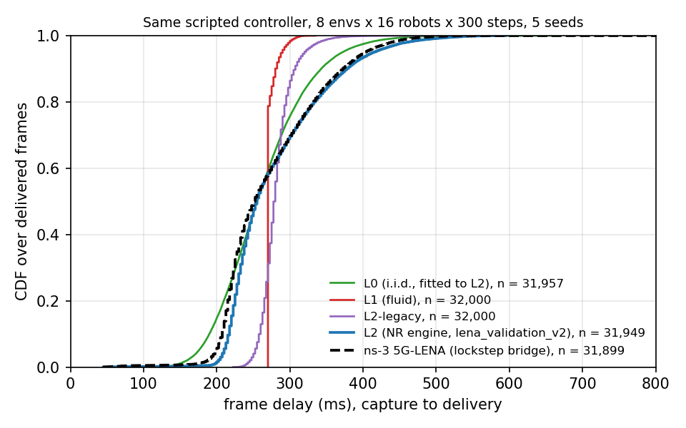
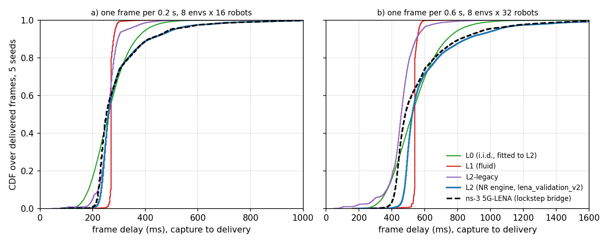

# Closed loop: one fixed controller over every network model

This page runs one scripted controller in a closed loop against each network model and records what the network delivers to it. The controller never changes and nothing is trained: the arms differ only in the network. The open-loop comparisons in [fidelity-vs-lena.md](fidelity-vs-lena.md) replay fixed traffic, while here the controller's sending depends on what was delivered before, so the traffic itself can differ between arms. The code is in `benchmarks/closedloop/` and every number below is in a CSV under `benchmarks/results/closedloop/`.

## Setup

**Task and controller.** The Fleet-Alert task of the [benchmark suite](benchmark-suite.md), reimplemented in `run_closedloop.py` with a smaller arena. Robots drive to random goals at 3 m/s. A hazard appears near a random robot, grows to a 15 m radius and lasts 10 s, and the fleet learns about it only when a camera frame captured within 50 m of it is delivered. The controller drives each robot to its goal and away from known hazards, and sends one 30 kB camera frame when the robot has no frame in flight and its send counter allows it. With the default `--interval 5` the counter lets a robot send at most once every 6 control steps (0.6 s), because it starts counting one step after a send. That is why the ideal arm below sends 6400 = 128 robots × 300 steps / 6 frames. A frame counts as lost if it has not arrived 2 s (20 control steps) after capture. The per-step reward is the progress to the goal in metres, minus 1 inside an active hazard, plus 2 per goal reached. The task return is its sum over the episode, averaged over robots.

**Geometry.** The example task's 150 m arena puts many robots below 5G-LENA's MCS-0 point, so in that arena the ns-3 reference delivers only 0–4% of what the engines deliver ([bridges.md](bridges.md)). This run therefore uses a 60 m × 60 m arena with the gNB at the corner and the radio of the 5G-LENA validation ([validation-5g-lena.md](validation-5g-lena.md)): path loss 40 + 35 log10(d) dB, 23 dBm UE power, thermal noise with a 7 dB noise figure (−101.44 dBm per 10-PRB subband), 6 dB per-robot shadowing drawn at reset, fading off, and UE power over the whole band. The validation's coverage rule (single-subband full-power SNR of at least 7 dB) is applied to the shadowing: a draw that would put the robot below 7 dB anywhere in the arena is redrawn. Every robot therefore stays inside the validated SNR range at every pose (at least 7 dB, 16.9 dB at the far corner without shadowing).

**Arms.** Every engine arm gets the same per-robot SNR each step, computed from the end-of-step pose. ns-3 gets that pose and the same shadowing and computes the same path loss itself.

| Arm | Model | Backend |
|:---|:---|:---|
| ideal | level `ORACLE`: every frame arrives in its capture step with zero delay and no loss | graph |
| L2 | NR engine with `lena_validation_v2()` | graph |
| L0 | i.i.d. lognormal delay and i.i.d. loss, fitted to the pooled L2 marginals (median 2.55 steps, log sigma 0.229, loss 0.0005; `l0_fit.csv`) | graph |
| L0-emp | level `L0` in its empirical mode: i.i.d. delay resampled from the pooled L2 delays, i.i.d. loss; run later on the same seeds, see [Empirical marginal](#empirical-marginal-l0-emp) | graph |
| L1 | fluid level, default parameters | graph |
| L2-legacy | the prototype slot-level engine | triton |
| ns-3 | ns-3.48 with 5G-LENA v5.1 through the lockstep bridge, one process per env over TCP | CPU |

**Scale.** 8 envs × 16 robots × 300 control steps (30 s), seeds 0 to 4, on the lab box (RTX 4090, 32 CPU cores, lightly loaded). One generator per seed draws every task random number with a fixed number of draws per step. Every arm therefore sees the same initial poses, goals, shadowing and hazard draws, and the runs differ only through what the network delivers. The L0 fit uses the L2 arm's delivered frames of all five seeds. The L2 arm counts a frame the engine loses after HARQ exhaustion (RLC UM) as in flight until its 2 s deadline, as the application sees it in ns-3.

## Results

Mean over the 5 seeds ± 95% t interval. Delay is capture to delivery over delivered frames. Delivery ratio is delivered / (delivered + lost), over frames resolved by the end of the episode. AoI is the age of each robot's newest delivered frame, sampled at every step. Wall time is the whole run of the arm (5 episodes, including engine construction and the task's own Python), and ms per step is per control step of all 8 envs (`per_seed.csv`, `summary.csv`).

| Arm | Delivery ratio | Delay p50 (ms) | Delay p95 (ms) | AoI mean (s) | AoI p95 (s) | Task return | Frames sent | ms per step | Wall (s) |
|:---|---:|---:|---:|---:|---:|---:|---:|---:|---:|
| ideal | 1 | 0 | 0 | 0.350 ± 0 | 0.60 ± 0 | 82.9 ± 2.6 | 6400 ± 0 | 1.9 | 2.9 |
| L2 | 0.9995 ± 0.0003 | 257 ± 13 | 409 ± 51 | 0.583 ± 0.017 | 0.86 ± 0.07 | 82.9 ± 2.4 | 6393 ± 4 | 41.9 | 63.1 |
| L0 | 0.9996 ± 0.0002 | 255 ± 1 | 372 ± 4 | 0.560 ± 0.002 | 0.80 ± 0 | 82.6 ± 2.4 | 6394 ± 2 | 2.1 | 3.1 |
| L1 | 1 | 270 ± 0 | 289 ± 10 | 0.548 ± 0.002 | 0.80 ± 0 | 82.9 ± 2.4 | 6400 ± 0 | 3.4 | 5.1 |
| L2-legacy | 1 | 279 ± 2 | 320 ± 10 | 0.558 ± 0.004 | 0.80 ± 0 | 82.9 ± 2.4 | 6400 ± 0 | 2.0 | 3.0 |
| ns-3 | 0.9990 ± 0.0007 | 252 ± 12 | 399 ± 33 | 0.582 ± 0.011 | 0.90 ± 0 | 82.9 ± 2.5 | 6386 ± 10 | 19.1 | 29.8 |

Distances between the delay distributions, pooled over the 5 seeds (`distances.csv`). W1 is the Wasserstein-1 distance in ms and KS the Kolmogorov-Smirnov statistic. The last two rows split one arm into its even and odd seeds, as a reference for how far two samples of the same model lie apart when their trajectories differ:

| Pair | W1 (ms) | KS |
|:---|---:|---:|
| L0 vs L2 | 17.5 | 0.161 |
| L1 vs L2 | 49.5 | 0.575 |
| L2 vs ns-3 | 6.8 | 0.113 |
| L2-legacy vs ns-3 | 42.5 | 0.460 |
| L0 vs ns-3 | 13.4 | 0.103 |
| L1 vs ns-3 | 52.4 | 0.576 |
| L2 even vs odd seeds | 21.5 | 0.101 |
| ns-3 even vs odd seeds | 16.0 | 0.075 |



*Delay CDF over all delivered frames of the 5 seeds. The ideal arm, a step at 0 ms, is not drawn.*

**What the network delivers.** With the same controller, L2 and ns-3 give nearly the same delivery ratio (0.9995 and 0.9990), delay quantiles (p50 257 and 252 ms, p95 409 and 399 ms) and AoI (0.583 and 0.582 s). Their pooled delay distributions are 6.8 ms apart in W1 with a KS of 0.11, which is within the distance between two seed halves of either arm alone. The pooled pair shares seeds and therefore trajectories, which is why it can lie closer than the split-half reference. L1 and L2-legacy deliver every frame and put almost all delays in a narrow band (L1 270–289 ms at p50–p95, L2-legacy 279–320 ms), while L2 and ns-3 spread from about 150 to 600 ms. That is a KS of 0.46–0.58 against both. L0 matches the L2 median and delivery ratio by construction, but its lognormal shape has a shorter tail (p95 372 ms against 409 ms) and a KS of 0.16 against L2.

**What the controller does with it.** The load stays below the point where the send rule reacts to the network: every arm sends 6386–6400 of the 6400 frames the 0.6 s send period allows, because almost every frame arrives before the robot's next send. The AoI therefore follows the delay (0.35 s ideal, 0.55–0.58 s for the other arms). The task return is 82.6–82.9 in every arm, including the ideal link, and the robots spend about 0.1% of their steps inside a hazard. In this setup the controller's return does not depend on the network model, so the return column says nothing about the models. The delay, delivery and AoI columns are the comparison.

**Wall time.** Including the task's own Python (1.9 ms per step with the ideal link), L0, L1 and L2-legacy need 2.0–3.4 ms per control step, and L2 with the `lena_validation_v2` switches on the graph backend needs 42 ms. ns-3 needs 19 ms per step with 8 processes in parallel on a lightly loaded box, about 5 s per 300-step episode. At E = 8 the ns-3 reference is faster than the L2 graph backend. The GPU engines scale to thousands of envs per step ([performance.md](performance.md)), and ns-3 needs one CPU process per env.

## Under load

The run above stays below the load at which the send rule reacts to the network. This section repeats it at two heavier loads with the same task, controller, geometry, seeds and arms: 1) one frame per robot every 0.2 s (`--interval 1`) at 8 × 16; and 2) 32 robots per env at the default 0.6 s period (`--R 32`), that is, 8 × 32. L0 is refitted to the L2 arm of each load on the same seeds (`l0_fit.csv`: median 2.60 and 5.25 steps, log sigma 0.268 and 0.266, no loss). A third run at one frame per 0.3 s (`--interval 2`, 8 × 16) is in the result folder and behaves like the 0.2 s run.

At both loads the robots' sends are limited by the frames in flight. With the ideal link they send 19,200 and 12,800 frames, while with L2 and ns-3 they send 11,000–11,400, because a robot waits 0.25–1 s for its previous frame before it sends the next one. The offered traffic therefore depends on the network model, which the light load above could not show.

The tables use the columns of the light-load table, plus the distance of each arm's delay distribution to ns-3. The pooled distances compare all 5 seeds of both arms and share trajectories. The disjoint-seed distances compare the arm's even seeds (0, 2, 4) with ns-3's odd seeds (1, 3), so the two samples share no trajectory and are directly comparable with the split-half references in the last two rows.

**One frame per 0.2 s, 8 envs × 16 robots** (`benchmarks/results/closedloop_loaded/interval1_8x16/`):

| Arm | Delivery ratio | Delay p50 (ms) | Delay p95 (ms) | AoI mean (s) | AoI p95 (s) | Task return | Frames sent | W1 / KS vs ns-3, pooled | W1 / KS vs ns-3, disjoint seeds |
|:---|---:|---:|---:|---:|---:|---:|---:|---:|---:|
| ideal | 1 | 0 | 0 | 0.150 ± 0.000 | 0.20 ± 0.00 | 82.7 ± 2.7 | 19200 ± 0 | 293.8 / 1.000 | – |
| L2 | 1 | 263 ± 13 | 506 ± 67 | 0.515 ± 0.054 | 0.96 ± 0.19 | 82.8 ± 2.2 | 11062 ± 672 | 7.0 / 0.176 | 26.5 / 0.121 |
| L0 (fitted to L2) | 1 | 259 ± 1 | 404 ± 1 | 0.436 ± 0.001 | 0.70 ± 0.00 | 82.7 ± 2.3 | 12083 ± 22 | 29.4 / 0.210 | 42.5 / 0.217 |
| L1 | 1 | 270 ± 0 | 285 ± 6 | 0.399 ± 0.002 | 0.50 ± 0.00 | 82.9 ± 2.3 | 12772 ± 34 | 61.1 / 0.545 | 73.7 / 0.496 |
| L2-legacy | 1 | 259 ± 2 | 327 ± 29 | 0.407 ± 0.005 | 0.54 ± 0.07 | 82.8 ± 2.2 | 12671 ± 78 | 39.8 / 0.199 | 54.3 / 0.281 |
| ns-3 | 0.9999 ± 0.0002 | 254 ± 15 | 500 ± 74 | 0.520 ± 0.056 | 0.98 ± 0.20 | 82.9 ± 2.4 | 11024 ± 677 | reference | reference |
| split-half reference: L2 even vs odd seeds | | | | | | | | 27.2 / 0.126 | |
| split-half reference: ns-3 even vs odd seeds | | | | | | | | 28.7 / 0.122 | |

**One frame per 0.6 s, 8 envs × 32 robots** (`benchmarks/results/closedloop_loaded/r32_8x32/`):

| Arm | Delivery ratio | Delay p50 (ms) | Delay p95 (ms) | AoI mean (s) | AoI p95 (s) | Task return | Frames sent | W1 / KS vs ns-3, pooled | W1 / KS vs ns-3, disjoint seeds |
|:---|---:|---:|---:|---:|---:|---:|---:|---:|---:|
| ideal | 1 | 0 | 0 | 0.350 ± 0.000 | 0.60 ± 0.00 | 82.0 ± 3.2 | 12800 ± 0 | 565.3 / 1.000 | – |
| L2 | 1 | 525 ± 11 | 1039 ± 64 | 1.023 ± 0.063 | 2.00 ± 0.20 | 81.9 ± 2.9 | 11235 ± 326 | 42.8 / 0.378 | 32.1 / 0.353 |
| L0 (fitted to L2) | 1 | 524 ± 2 | 811 ± 3 | 0.867 ± 0.002 | 1.30 ± 0.00 | 81.9 ± 2.9 | 11864 ± 14 | 51.1 / 0.130 | 51.5 / 0.113 |
| L1 | 1 | 540 ± 0 | 565 ± 9 | 0.839 ± 0.001 | 1.10 ± 0.00 | 82.0 ± 2.8 | 12797 ± 6 | 129.8 / 0.592 | 135.1 / 0.575 |
| L2-legacy | 1 | 458 ± 9 | 586 ± 14 | 0.747 ± 0.011 | 1.06 ± 0.07 | 82.0 ± 2.7 | 12720 ± 41 | 108.4 / 0.257 | 119.0 / 0.282 |
| ns-3 | 0.9966 ± 0.0032 | 483 ± 10 | 979 ± 62 | 1.028 ± 0.114 | 1.94 ± 0.29 | 81.8 ± 2.9 | 11353 ± 315 | reference | reference |
| split-half reference: L2 even vs odd seeds | | | | | | | | 19.0 / 0.061 | |
| split-half reference: ns-3 even vs odd seeds | | | | | | | | 14.8 / 0.045 | |



*Delay CDF over all delivered frames of the 5 seeds, (a) one frame per 0.2 s at 8 × 16, (b) one frame per 0.6 s at 8 × 32. The ideal arm, a step at 0 ms, is not drawn.*

**At 0.2 s, L2 tracks ns-3 and L0 does not.** With disjoint seeds, L2 lies 26.5 ms (W1) and 0.121 (KS) from ns-3, which equals the split-half references of 27–29 ms and 0.12–0.13. L0 lies 42.5 ms and 0.217 from ns-3, about 1.5 times the W1 reference and 1.7 times the KS reference. The difference sits in the tail: L0's p95 is 404 ms against 506 ms for L2 and 500 ms for ns-3. The controller sees it. Under L0 the mean AoI is 16% lower than under ns-3 (0.436 against 0.520 s), the AoI p95 is 29% lower (0.70 against 0.98 s), and the robots send 12,083 frames, 9.6% more than the 11,024 of ns-3, since a short-tailed delay frees the in-flight slot sooner. L2 gives 0.515 s, 0.96 s and 11,062 frames. The pooled L0 W1 (29.4 ms) lies within the references, so at this sample size the pooled W1 alone does not separate the two models.

**At 32 robots per env, neither model reproduces ns-3's delay distribution.** L2's delays lie 40–60 ms above those of ns-3 from the 5th to the 50th percentile (p50 525 against 483 ms, +9%), while the tail agrees within 7% (p95 1039 against 979 ms, p99 1505 against 1441 ms). This offset gives a disjoint-seed KS of 0.353 against split-half references of 0.061 and 0.045, so at this load L2 is measurably slower than ns-3 in closed loop. The open-loop saturated cells of the 5G-LENA sweep put the v2 median error at −0.1% ([fidelity-vs-lena.md](fidelity-vs-lena.md)), and the cause of the closed-loop offset has not been isolated. L0 has the lower KS (0.113 with disjoint seeds) because its wide lognormal crosses the body of the ns-3 distribution, but it misses the tail (p95 811 against 979 ms) and has the larger W1 (51.5 against 32.1 ms for L2). On what the controller sees, L2 matches ns-3 (mean AoI 1.023 against 1.028 s, AoI p95 2.00 against 1.94 s, 11,235 against 11,353 frames sent), whereas L0 gives 16% lower mean AoI (0.867 s), 33% lower AoI p95 (1.30 s) and 4.5% more frames (11,864).

**The task return is still flat.** Every arm at every load, the ideal link included, returns 81.8–82.9, and the robots spend at most 0.26% of their steps inside a hazard. The heavier loads change the delay, the AoI and the number of frames sent, but not the return of this controller, so the return column still says nothing about the models.

**In short.** Under load, an i.i.d. lognormal fitted to the engine's own marginals departs from ns-3 in what the controller observes: the AoI tail and the number of frames sent at both loads, and the delay distribution at 0.2 s. The NR engine with `lena_validation_v2` matches ns-3 on those quantities at both loads and on the delay distribution at 0.2 s, but at 32 robots per cell its delay body lies about 9% above that of ns-3. Part of L0's miss comes from the lognormal shape, and [Empirical marginal](#empirical-marginal-l0-emp) separates shape from independence.

**Wall time.** At 8 × 16 and 0.2 s, L2 needs 45.6 ms and ns-3 41.7 ms per control step, and at 8 × 32, 59.2 and 57.2 ms. The 0.2 s run shared the box with 8 other ns-3 processes (the held-out scenario of [fidelity-heldout.md](fidelity-heldout.md)), so its ns-3 timing is pessimistic.

**One frame per 0.3 s, 8 envs × 16 robots** (`benchmarks/results/closedloop_loaded/interval2_8x16/`), for reference:

| Arm | Delivery ratio | Delay p50 (ms) | Delay p95 (ms) | AoI mean (s) | AoI p95 (s) | Task return | Frames sent | W1 / KS vs ns-3, pooled | W1 / KS vs ns-3, disjoint seeds |
|:---|---:|---:|---:|---:|---:|---:|---:|---:|---:|
| ideal | 1 | 0 | 0 | 0.200 ± 0.000 | 0.30 ± 0.00 | 82.7 ± 2.5 | 12800 ± 0 | 288.4 / 1.000 | – |
| L2 | 1 | 260 ± 14 | 503 ± 71 | 0.511 ± 0.056 | 0.98 ± 0.20 | 82.9 ± 2.3 | 11073 ± 676 | 7.1 / 0.144 | 27.9 / 0.127 |
| L0 (fitted to L2) | 1.0000 ± 0.0001 | 258 ± 1 | 417 ± 2 | 0.441 ± 0.001 | 0.70 ± 0.00 | 82.7 ± 2.4 | 11412 ± 15 | 25.9 / 0.160 | 41.0 / 0.203 |
| L1 | 1 | 270 ± 0 | 284 ± 6 | 0.397 ± 0.002 | 0.50 ± 0.00 | 82.9 ± 2.3 | 12776 ± 30 | 62.1 / 0.480 | 73.5 / 0.441 |
| L2-legacy | 1 | 208 ± 14 | 310 ± 29 | 0.354 ± 0.017 | 0.52 ± 0.06 | 82.7 ± 2.5 | 12562 ± 133 | 76.8 / 0.467 | 103.0 / 0.535 |
| ns-3 | 0.9998 ± 0.0002 | 251 ± 18 | 495 ± 79 | 0.516 ± 0.059 | 0.98 ± 0.20 | 82.9 ± 2.4 | 11032 ± 690 | reference | reference |
| split-half reference: L2 even vs odd seeds | | | | | | | | 30.7 / 0.141 | |
| split-half reference: ns-3 even vs odd seeds | | | | | | | | 34.2 / 0.154 | |

## Empirical marginal (L0-emp)

L0 above is a two-parameter lognormal. A lognormal with the L2 median and log sigma cannot reach the L2 tail (its p95 is 404 ms at 0.2 s and 811 ms at 8 × 32, against 506 and 1,039 ms for L2), so the misses of L0 under load could come from that shape and not from the independence of the draws. L0-emp separates the two. It draws each message's delay i.i.d. from the empirical marginal of the same pooled L2 delays that L0 is fitted to, at each load and on the same seeds. It uses level `L0` with `params={"q": <sorted L2 delays in control steps>, "p": <loss>}`: each delay is one of the L2 delays, chosen by the rank of L0's own normal draw (inverted CDF), so the whole tail is kept. The loss is fitted as for L0, so that L0-emp's delivery ratio, counting the sample's share beyond the 2 s deadline, equals that of L2 (no extra loss at any load here; the 0.28% of L2 delays above 2 s at 8 × 32 time out). The send rule, task, seeds and geometry are those of the runs above. ns-3, L2 and L0 are not rerun: their frames and per-seed rows come from the earlier folders. L0 was rerun in the same job as a check and reproduces the earlier L0 bit for bit in 104 of 105 seed-metric values (the last differs by 0.002 ms in a delay p95). Code: `run_closedloop.py --arms L0,L0-emp --fit-from <folder>` and `l0emp_compare.py`. Results: `benchmarks/results/closedloop/l0emp/`.

Mean over 5 seeds ± 95% t interval, with the difference to ns-3 in brackets. "P(AoI > x)" is the share of robot-steps whose AoI exceeds ns-3's AoI p95, rounded up to the 0.1 s step (0.9, 1.0 and 2.0 s). It is computed from the AoI rebuilt out of `frames.csv.gz`, which reproduces the logged AoI mean of every arm and seed. The KS columns compare the arm's even seeds with ns-3's odd seeds, for the delay and for the AoI, and the floor is the split-half distance of L2 and of ns-3 (`comparison.csv`, `aoi.csv`, `closedloop_distances.csv`).

| Load | Arm | Delay p50 / p95 (ms) | AoI mean (s) | AoI p95 (s) | Frames sent | P(AoI > x) | Delay KS | AoI KS |
|:---|:---|---:|---:|---:|---:|---:|---:|---:|
| 0.6 s, 8 × 16 | L2 | 257 / 409 | 0.583 | 0.86 ± 0.07 (−4.4%) | 6,393 ± 4 (+0.1%) | 1.33 ± 1.50% | 0.118 | 0.029 |
| | L0 | 255 / 372 | 0.560 | 0.80 ± 0.00 (−11.1%) | 6,394 ± 2 (+0.1%) | 0.58 ± 0.07% | 0.123 | 0.044 |
| | L0-emp | 255 / 415 | 0.585 | 0.90 ± 0.00 (0.0%) | 6,394 ± 2 (+0.1%) | 1.41 ± 0.13% | 0.112 | 0.012 |
| | ns-3 | 252 / 399 | 0.582 | 0.90 ± 0.00 | 6,386 ± 10 | 1.24 ± 1.18% | | |
| | floor | | | | | | 0.075–0.101 | 0.025–0.035 |
| 0.2 s, 8 × 16 | L2 | 263 / 506 | 0.515 | 0.96 ± 0.19 (−2.0%) | 11,062 ± 672 (+0.3%) | 4.22 ± 2.90% | 0.122 | 0.115 |
| | L0 | 259 / 404 | 0.436 | 0.70 ± 0.00 (−28.6%) | 12,083 ± 22 (+9.6%) | 0.01 ± 0.01% | 0.217 | 0.177 |
| | L0-emp | 260 / 507 | 0.487 | 0.80 ± 0.00 (−18.4%) | 11,042 ± 26 (+0.2%) | 1.31 ± 0.03% | 0.108 | 0.097 |
| | ns-3 | 254 / 500 | 0.520 | 0.98 ± 0.20 | 11,024 ± 677 | 4.34 ± 2.87% | | |
| | floor | | | | | | 0.122–0.126 | 0.108–0.110 |
| 0.6 s, 8 × 32 | L2 | 525 / 1,039 | 1.023 | 2.00 ± 0.20 (+3.1%) | 11,235 ± 326 (−1.0%) | 4.38 ± 1.93% | 0.353 | 0.033 |
| | L0 | 524 / 811 | 0.867 | 1.30 ± 0.00 (−33.0%) | 11,864 ± 14 (+4.5%) | 0.01 ± 0.01% | 0.113 | 0.123 |
| | L0-emp | 525 / 1,027 | 0.967 | 1.62 ± 0.06 (−16.5%) | 11,284 ± 44 (−0.6%) | 1.42 ± 0.30% | 0.353 | 0.046 |
| | ns-3 | 483 / 979 | 1.028 | 1.94 ± 0.29 | 11,353 ± 315 | 4.27 ± 1.89% | | |
| | floor | | | | | | 0.045–0.061 | 0.034–0.039 |

**The lognormal shape explains the frames sent and about half of the AoI p95 miss.** With the empirical marginal, the robots send within 0.2% and 0.6% of what they send under ns-3 at the two loaded settings, well inside ns-3's seed interval (±6.1% and ±2.8%), against +9.6% and +4.5% for L0. The delay distribution also matches as well as L2 does: at 0.2 s the disjoint-seed delay KS is 0.108, at the floor, and at 8 × 32 it is 0.353, the same offset as L2, since L0-emp resamples L2's delays. The AoI p95 miss shrinks from −29% to −18% at 0.2 s and from −33% to −16.5% at 8 × 32, and the mean AoI miss from −16% to −6% at both.

**Independence misses the AoI tail.** The rest of the gap does not close. Under L2 and ns-3, 4.2–4.4% of robot-steps have an AoI above ns-3's p95 at both loaded settings, while under L0-emp only 1.3–1.4% do. Paired by seed, the ns-3 share exceeds the L0-emp share in all five seeds at both loads, by 3.0 ± 2.9 and 2.9 ± 2.1 percentage points, whereas L2 differs from ns-3 by 0.1 points. On the AoI p95 statistic alone at five seeds, the −18% at 0.2 s lies inside ns-3's seed interval of ±21% and the −16.5% at 8 × 32 just outside its ±15%. The AoI distribution separates the same way at 8 × 32 (AoI KS 0.046 for L0-emp against floors of 0.034–0.039 and 0.033 for L2), but not at 0.2 s, where L0-emp's AoI KS of 0.097 lies within the floor. The mechanism is visible in the delays themselves. Under L2 and ns-3, 64–70% of the delay variance lies between robots, and successive delays of one robot are correlated around that robot's mean (lag-1 correlation 0.86–0.94). Under L0 and L0-emp both are zero (0.01–0.02 and −0.02). A robot that drew long delays under L2 or ns-3 keeps drawing them, so its AoI grows over several messages, while an i.i.d. draw spreads the long delays over all robots. At light load nothing separates: L0-emp matches ns-3 in AoI p95 (0.90 s), frames sent and AoI distribution (KS 0.012).

**In short.** Both stories hold in part. The lognormal shape caused the frames-sent miss and about half of the AoI p95 miss. Independence causes the rest: an i.i.d. draw from the exact closed-loop marginal still leaves the AoI tail about three times too light under load, about 16–18% low at the p95. What was tested is one marginal shared by all robots. A delay model conditioned on each robot's SNR or history was not tested, and the large between-robot share suggests it would close part of the gap. The empirical marginal itself is only known after L2 (or ns-3) has run in closed loop under the same controller, since the offered traffic depends on the network model.

**Seed intervals of the AoI p95.** The 95% t intervals over the 5 seeds, as a share of the mean, for every arm of the three runs (`comparison.csv`, column `aoi_p95_s_ci95_pct`): at light load ±7.9% for L2 and ±0 for every other arm (every seed gives the same value on the 0.1 s step grid); at 0.2 s ±19.6% for L2, ±20.8% for ns-3, ±12.6% for L2-legacy and ±0 for ideal, L0, L0-emp and L1; at 8 × 32 ±9.8% for L2, ±14.7% for ns-3, ±6.4% for L2-legacy, ±3.4% for L0-emp and ±0 for ideal, L0 and L1. The frames sent have ±0.07% (L2) and ±0.15% (ns-3) at light load, ±6.1% for both at 0.2 s and ±2.9% and ±2.8% at 8 × 32.

**Figure data.** `l0emp/closedloop_delay_quantiles.csv` (1,001 quantiles, inverted CDF, of every arm's delivered delays per run) and `l0emp/closedloop_distances.csv` (every run's `distances.csv` with a `run` column, plus the L0-emp rows and the disjoint-seed rows of the light load) have the format of the paper's figure data and keep every earlier row unchanged, so they can replace it as they are.

## Caveats

- **One controller.** A single scripted controller with a fixed send rule. A controller that sends more often, or reacts to delay, would load the cell differently, and the distances above would change with it.
- **One geometry.** A single cell, a 60 m arena kept inside the validated SNR range, fading off. In the example task's 150 m arena the ns-3 reference loses most frames to the coverage gap, and none of the numbers here carry over to it.
- **Small scale.** 8 envs, 5 seeds of 30 s and one message size. The loaded regime, where the send rule reacts to queueing, is covered by the section [Under load](#under-load) below. The task return is not sensitive to the network at any of the tested loads.
- **L0 is fitted to this run.** Its parameters come from the L2 arm of the same seeds, so its agreement with L2 on the median and the delivery ratio is by construction. Every load refits it. L0-emp resamples the same L2 delays, so its agreement with L2's delay distribution is by construction too.
- **Shared seeds.** The pooled pairs share seeds and therefore trajectories, so a pooled distance can lie below the split-half reference. The disjoint-seed column of the loaded runs (one arm's even seeds against ns-3's odd seeds) avoids this.

## Reproduce

On a machine with a CUDA GPU, the locally generated 5G-LENA tables (`ISAAC_NET_LENA_TABLES`) and the lockstep bridge built as in [bridges.md](bridges.md) (`NS3BRIDGE_ROOT`, `NS3_TOOLCHAIN_ENV`):

```bash
python benchmarks/closedloop/run_closedloop.py --out benchmarks/results/closedloop
python benchmarks/closedloop/plot_cdf.py benchmarks/results/closedloop docs/img/closed-loop-delay-cdf.png
# under load
python benchmarks/closedloop/run_closedloop.py --interval 1 --out benchmarks/results/closedloop_loaded/interval1_8x16
python benchmarks/closedloop/run_closedloop.py --R 32 --out benchmarks/results/closedloop_loaded/r32_8x32
python benchmarks/closedloop/run_closedloop.py --interval 2 --out benchmarks/results/closedloop_loaded/interval2_8x16
python benchmarks/closedloop/plot_cdf_loaded.py benchmarks/results/closedloop_loaded docs/img/closed-loop-loaded-cdf.png
# empirical marginal, fitted to the L2 arm of each earlier run (no L2 or ns-3 rerun), then the comparison
O=benchmarks/results/closedloop/l0emp
python benchmarks/closedloop/run_closedloop.py --arms L0,L0-emp --fit-from benchmarks/results/closedloop --out $O/light_8x16
python benchmarks/closedloop/run_closedloop.py --arms L0,L0-emp --interval 1 --fit-from benchmarks/results/closedloop_loaded/interval1_8x16 --out $O/i02_8x16
python benchmarks/closedloop/run_closedloop.py --arms L0,L0-emp --R 32 --fit-from benchmarks/results/closedloop_loaded/r32_8x32 --out $O/r32_8x32
python benchmarks/closedloop/l0emp_compare.py
```

`--interval` sets the send counter (5: one frame per 0.6 s, 1: per 0.2 s) and `--R` the robots per env. `--arms` selects a subset (L0 and L0-emp need L2 earlier in the list, since they are fitted to it, or `--fit-from` with an earlier run folder that has the L2 arm). The result folder holds `per_seed.csv` (every metric per arm and seed), `summary.csv` (means and 95% intervals), `delay_cdf.csv` (pooled CDF on a log grid from 0.1 ms to 2 s), `distances.csv`, `l0_fit.csv`, `frames.csv.gz` (every delivered frame: arm, seed, env, robot, capture step, delay), `setup.json` and the run log.
