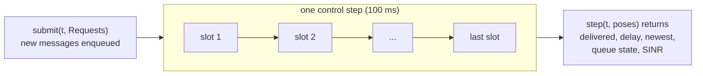

# Concepts

This page explains the five ideas the engine is built on. It is written for two readers: a networking researcher who has used ns-3 but not a GPU-parallel RL simulator, and a robotics researcher who has trained policies in Isaac Lab but has not looked inside a 5G stack. A [glossary](#glossary) for both directions is at the end.

## The setting

An RL training run in Isaac Lab steps `E` copies of a scene at once, often thousands, and each copy (an *environment*, or *env*) holds `R` robots. At every control step, typically 100 ms of simulated time, the policy picks actions for every robot, the physics advances, and the task computes observations and rewards. If the robots communicate, for example by uploading camera frames to an edge server, what the receiver knows depends on the network: a message may wait in a queue while other robots transmit, it may need several transmissions over a fading channel, and it may arrive too late to matter.

`isaac-net` simulates the 5G uplink of all `E` environments in the same GPU process as the physics, one control step at a time. Every call to `step` advances every environment's network by exactly one control step, so network time never drifts from physics time.

## Slot-synchronous stepping instead of discrete events

A packet-level simulator such as ns-3 is a *discrete-event* simulator. It keeps a queue of timestamped events (a packet arrives, a timer fires, a transport block is decoded), pops the earliest one, runs its handler, and schedules new events. This is exact and flexible, but it is inherently sequential: each scenario has its own event order, so thousands of scenarios cannot share one instruction stream, and each handler is ordinary CPU code.

5G, however, is already organized in time slots. The base station (the *gNB*) schedules the air interface once per slot, 0.5 ms at the default numerology, and every uplink transmission starts and ends on slot boundaries. The engine exploits this. It advances time in fixed slots and performs the same tensor operations for every environment and robot in every slot: update the fading, decide which robots have a grant, pick a modulation and coding scheme, draw whether each transport block decodes, and move the served bytes out of the queues. Where nothing happens for a robot in a slot, a mask turns the operation into a no-op instead of a branch. The GPU therefore executes one program for all environments at once.

The price is time resolution. A message completes at the end of the slot in which its last byte is decoded, so delays are multiples of the slot spacing: 2.5 ms between uplink slots for `L2-legacy` (40 uplink slots per 100 ms control step), and the numerology's slot length for the configurable NR engine `L2`. For robot control at 10 Hz this resolution is far finer than the control step. Effects below one slot, such as the exact symbol at which a packet reaches the MAC, are not modelled.

Because every slot runs as tensor operations for all robots at once, there is no event log to read. When you need one, for example to see why a message took 40 ms, attach a [slot trace](trace.md) to a few robots: `SlotTrace` reads the MAC after every slot of the reference backend and rebuilds the event sequence of those robots (arrival, scheduling request, grants, transport blocks, HARQ feedback, retransmissions, delivery) without changing any output, and `isaac_net.viz.trace.plot_timeline` draws it.

The lower fidelity levels do not simulate slots at all. `L0` draws each message's delay from a distribution when the message is submitted, and `L1` shares each slot's capacity equally among the robots with queued data. They keep the same interface, so a task can switch between them and the slot-level models by changing one argument.

## Fixed-shape state

Every piece of network state is a tensor whose shape is fixed when the engine is built. Per-robot state has shape `[E, R]`, per-subband state `[E, R, S]`, and the message queue of each robot is a buffer of `F` message slots, `[E, R, F]` (16 by default). The queue is kept compacted, so slot 0 is the head of the line, and an empty slot has capture step `-1`.

Fixed shapes are what make batching possible. No Python loop runs over environments, robots or cells, and the fast backends can record a whole control step as one CUDA graph, which requires that no tensor changes shape and that the host never waits on the GPU in the middle of the step.

Fixed shapes also have visible consequences for a task:

- A robot can hold at most `F` messages. `submit` returns an `accepted [E, R]` mask, which is `False` where the robot sent nothing or its buffer was full.
- Every message has an application deadline (20 control steps, 2 s, by default). A message that is not delivered by then is dropped and reported in `timed_out`.
- Outputs refer to message *slots*. `delivered[e, r, f]` is about the message that sat in slot `f` of robot `r`'s queue before the step, and `cap` and `cls` tell you which message that was.
- Memory grows with `E × R × F`, independently of how many messages are actually in flight.

## Per-env clocks and partial resets

Isaac Lab resets environments individually: when one episode ends, only that environment restarts, while the others continue. The engine mirrors this with a clock per environment. `net.clock` is an `[E]` tensor of control steps since each environment's last reset, `reset(env_ids)` sets the clock of those environments back to 0, and all outputs (capture steps, `newest`, `t`) are expressed in each environment's own clock. Passing `t=None` to `submit` and `step` uses these clocks and is the recommended form.

A partial reset re-initializes everything the listed environments own: queues, MAC and HARQ state, link adaptation, fading, the shadowing field of the radio, and the clock. It is exact in two senses:

1. **Isolation.** Every other environment is left bit for bit unaffected, in its outputs and in its internal state. The test suite checks this for every level.
2. **Random streams.** With `rng="engine"` (the default) every draw, including stepping, fading and radio fields, is keyed by (seed, env id, episode, step), with the seed from `make_engine(..., seed=...)`; `rng="global"` uses the engine generator for resets and the global torch RNG for stepping. Resetting one environment therefore never shifts the random numbers another environment consumes.

The configurable NR engine keeps one global slot clock internally, because its HARQ, scheduling-request and CQI timers are counted in slots. It presents per-env clocks on top of it by storing the step at which each environment was last reset. For this reason it cannot jump in time: an explicit `t` must equal the engine clock, and after a partial reset only `t=None` is accepted.

## Checkpoints

Because all network state is tensors, plus a few host values such as the NR engine's global slot clock, a running network can be saved and resumed exactly. `net.state_dict()` returns every state tensor, the state of every `torch.Generator` (the traffic models draw from their own) and those host values, under flat keys such as `net.ul.q.cap`. `net.load_state_dict(sd)` copies them back in place, so the fast backends keep their static buffers. The counter RNG makes this simple: its whole state is the per-env episode and call counters and the env offsets, so restoring them puts every env back on exactly the random stream it was on. A resume on the same backend and device is bitwise equal to the uninterrupted run. `isaac_net.core.checkpoint.save` and `load` add a file with a compatibility check, and with rsl_rl the network is saved next to every policy checkpoint. See [Checkpoints](checkpoint.md).

## Messages, delay and age of information

A robot hands the network at most one message per control step, as a traffic class: `Requests.send[e, r] = c` enqueues one message of `NRConfig.msg_sizes[c - 1]` bytes, and `0` sends nothing. The message is stamped with the current capture step. `step` then reports, for every message that completed, its `delay` in control steps from capture to delivery. On level `L2`, traffic models can also generate messages inside the step, several per control step if needed, and their delay counts from their arrival slot (see [Traffic models](configurability.md#traffic-models)).

For a task, the most useful quantity is often the *age of information* (AoI): how old the freshest delivered information about a robot is. If `last[e, r]` is the newest capture step delivered so far, the AoI at the end of control step `t` is `t + 1 - last[e, r]` control steps. `step` returns `newest`, the newest capture step delivered in this step, so keeping `last` is one `torch.maximum` per step. The Isaac layer keeps it for you and returns `aoi_s` in seconds.

Timing matters here. In the Isaac layer a message is captured at the pose at the *start* of the control step, and the network step receives the poses at the *end* of it. If the post-physics pose were stamped as the capture of step `t`, every delay and AoI would come out one control step too optimistic.

## Backends and the equivalence guarantee

Each level has one readable implementation, the `reference` backend, written as ordinary eager PyTorch. The fast backends run the same model faster:

| Backend | What it does | Relation to `reference` |
|:---|:---|:---|
| `reference` | readable eager code; the definition of the model | itself |
| `eager` | the graph-safe operations of the fast engine, run eagerly | bitwise equal |
| `graph` | the same operations recorded once as a CUDA graph and replayed every step | bitwise equal, including random partial resets |
| `compile` | `torch.compile` plus a CUDA graph | equal to rounding |
| `triton` | all slots of a control step in one fused Triton kernel (`L1`, `L2-legacy`) | equal to rounding: from an identical state every finish time agrees, and over long runs aggregate delivery and delay agree to three or four significant digits |

"Bitwise equal" is checked by driving both backends from the same state with the same random draws. The fast backends can take their per-slot random numbers from an injected source (`make_engine(..., inject=True)`), so the test feeds identical noise to both and compares every output and every state tensor after every step. The rule for contributors follows from this: a change to a prototype level goes into the eager reference first, and the `graph` backend must stay bitwise equal to it.

Use `graph` for runs whose numbers must be reproducible against the reference, and `triton` for scale. The NR engine `L2` has `graph` (bitwise equal to its reference, one or several cells) and `triton` (one cell). [Performance](performance.md) has the measured costs.

`make_engine(..., backend="auto")` picks the fastest backend that can run the config on the device and logs why ([Choosing a backend automatically](configurability.md#choosing-a-backend-automatically)). Whatever the backend, `net.output_schema()` lists the keys `step` returns, with shape, dtype, unit and meaning ([Output schema](configurability.md#output-schema)).

## Fidelity levels

All levels come from `make_engine(level, E, R, device, config, backend)` and share the same API. They fall into three groups.

**Simulators** model the network itself. `L0` and `L0DR` give each message an independent lognormal delay and loss, fixed or redrawn per environment at every reset. `L05` and `L05Q` look the delay up in tables fitted offline from `L2` rollouts, conditioned on the load and the SNR at submission. `L1` is a fluid slot model with equal shares of the uplink and FIFO queues. `L2-legacy` is the frozen prototype slot-level MAC and PHY. `L2` is the configurable NR engine with 3GPP tables, multiple HARQ processes, an optional downlink and up to 7 cells with interference and handover. Both slot-level engines run multi-cell configurations.

**Surrogates** are fitted from rollouts of `L2` or `L2-legacy` and imitate them cheaply. `TR` replays recorded traces open loop, `GE` is a three-state Markov-modulated delay and loss chain per environment, `QA` is an analytic processor-sharing queue per control step, and `NN` is a small neural network that predicts a drop probability and delay quantiles from features known at submission.

**Bounds** are not network models. `ORACLE` delivers every message at capture with zero delay, and `NOCOMM` never delivers anything. They bracket what any network can give a task, and they are the first check when you design one: if a task's returns under `ORACLE` and `NOCOMM` are close, the policy barely uses what the network carries, and the task cannot tell fidelity levels apart.

Higher fidelity costs more per step, and it changes what a policy experiences: whether a message's delay depends on what the other robots send, whether a robot at the cell edge loses more, and whether retransmissions stretch the tail. The [fidelity level reference](reference/levels.md) lists every level with its parameters and backends, and [Tutorial 02](tutorials/02_choosing_fidelity.ipynb) runs several of them on the same traffic.

## Configurations and scenarios

One `NRConfig` configures every level. Most users start from a preset and override a few fields: the 5G-LENA validation presets (`lena_validation_v2()`), or a scenario preset for a deployment, such as `warehouse_private_5g()`, `factory_inf()`, `outdoor_campus()` or `urllc_control()` ([Scenario presets](configurability.md#scenario-presets)). `cfg.describe()` prints what a config turns on, which backends can run it and which fields the chosen level would ignore, and `cfg.diff(other)` lists the fields two configs disagree on ([Describing a configuration](configurability.md#describing-a-configuration)). A level that ignores a field you set triggers a warning when the engine is built ([Ignored fields](configurability.md#ignored-fields-warning-and-strict-mode)).

## Glossary

**For robotics readers**

| Term | Meaning |
|:---|:---|
| gNB, UE | the 5G base station, and a user device (here, a robot's modem) |
| uplink (UL), downlink (DL) | robot to base station, and base station to robot |
| numerology `mu` | sets the subcarrier spacing (15 × 2^mu kHz) and the slot length (1 ms / 2^mu) |
| slot | the scheduling unit in time, 14 OFDM symbols |
| TDD pattern | which slots carry downlink (`D`) or uplink (`U`) data, with special (`S`) slots that switch between them, for example `DDDSU` |
| PRB, RBG, subband | a physical resource block is 12 subcarriers for one slot; a resource block group, or subband, is a set of PRBs scheduled together |
| SR, BSR, grant | a scheduling request says "I have data", a buffer status report says how much, and a grant lets a robot transmit in a given slot |
| PF scheduler | proportional fair: each slot, resources go to robots with a good channel relative to their average throughput |
| MCS, TBS | modulation and coding scheme, and the transport block size it gives for an allocation |
| SINR, BLER | signal to interference plus noise ratio, and the probability that a transport block fails to decode |
| HARQ | fast retransmission of a failed transport block; several HARQ processes let new data go out while one block waits |
| OLLA | outer-loop link adaptation: nudges the chosen MCS so that the observed BLER meets a target |
| RLC AM / UM | the radio link layer in acknowledged mode (lost data is resent) or unacknowledged mode (lost data stays lost) |
| AoI | age of information: how old the freshest delivered information is |

**For networking readers**

| Term | Meaning |
|:---|:---|
| env (environment) | one independent copy of the task scene; `E` of them are simulated in parallel on one GPU |
| episode | one run of an environment from reset to termination; each environment's episodes end at different times |
| control step | one policy decision, typically 100 ms of simulated time; in Isaac Lab terms one environment step, `decimation` physics steps of `sim.dt` each |
| environment step | Isaac Lab's step of all robots of one environment by one control step; Isaac Lab reports environment steps per second, and robot-steps per second is that rate times the robots per environment |
| physics substep | this project's name for one Isaac Lab physics step (`sim.dt`), several of which form a control step (`decimation`); not a PhysX or Isaac Gym solver substep |
| `DirectRLEnv` | the Isaac Lab base class of a task, with hooks called in a fixed order each step |
| `ManagerBasedRLEnv` | Isaac Lab's other task style, where observations, rewards, events and terminations are config terms rather than hooks; `NetManagerCfg` adds the network's terms ([Manager-based workflow](isaac-lab.md#manager-based-workflow)) |
| partial reset | restarting only the environments whose episodes ended, while the others keep running |
| domain randomization | drawing simulator parameters at random per environment so that a policy does not overfit one setting |
| observation, reward | what the policy sees each step, and the scalar it is trained to maximize |
| PPO, rsl_rl | a standard on-policy RL algorithm, and the library Isaac Lab uses to run it |
