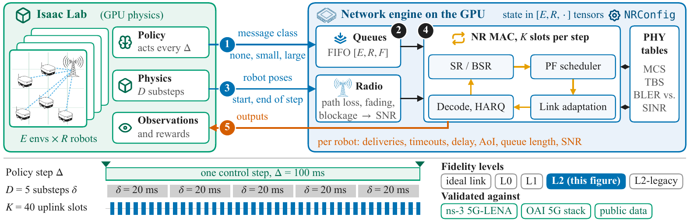

# isaac-net

{ .isaac-hero loading=lazy }

**GPU-batched 5G network simulation for massively parallel robot learning: thousands of Isaac Lab environments, tens to hundreds of robots per cell, one GPU, network state stepped in lockstep with physics.**

Parallel robot learning runs thousands of environments on one GPU, but the network between robots and the edge is usually reduced to a fixed or random delay, if it is modeled at all. Packet-level simulators such as ns-3 capture scheduling, retransmissions and contention, but they run one scenario at a time on a CPU, far from the throughput an RL loop needs. `isaac-net` closes that gap. Every piece of network state, from each robot's channel and HARQ process to its queued messages, is a fixed-shape tensor with leading dimensions `[envs, robots]`, and the engine advances the uplinks of all environments slot by slot on the GPU, in lockstep with the physics.



*One control step: Isaac Lab submits message classes and robot poses, the engine runs the K uplink slots of the NR MAC with all state in `[envs, robots, ...]` tensors, and per-robot deliveries, delays, AoI and SNR return as observations.*

The package is an early research prototype. These pages are for collaborators who are joining the project.

## Where to start

| If you want to | Read |
|:---|:---|
| install the package and run a network in ten lines | [Install](#install) below, then [Tutorial 01](tutorials/01_first_network.ipynb) |
| understand the ideas behind the engine (slot-synchronous stepping, fixed shapes, per-env clocks, backends, fidelity levels) | [Concepts](concepts.md) |
| pick a fidelity level or fit a surrogate | [Tutorial 02](tutorials/02_choosing_fidelity.ipynb) and [Fidelity levels](reference/levels.md) |
| configure the NR model (numerology, TDD, HARQ, cells) | [Tutorial 03](tutorials/03_configuring_nr.ipynb) and [Configuration](reference/config.md) |
| put the network into an Isaac Lab task | [Tutorial 04](tutorials/04_isaac_lab_integration.ipynb) and [Isaac Lab layer](reference/isaac.md) |
| compare against ns-3 and 5G-LENA | [Tutorial 05](tutorials/05_validating_against_ns3.ipynb) and [ns-3 bridges](reference/bridges.md) |
| know what is done and what is open | [Status](STATUS.md) |
| check what you may redistribute | [Licensing](licensing.md) |

## Install

```bash
git clone git@github.com:ZzZTripleZzZ/isaac-net.git && cd isaac-net
uv venv --python 3.11 && source .venv/bin/activate
uv pip install torch                                # CUDA build of PyTorch; Triton ships with it on Linux
uv pip install -e ".[dev]"                          # the isaac_net package, plus pytest and ruff
```

The fast backends need Linux with an NVIDIA GPU. The reference engines, the tests and the tutorials also run on a CPU. The Isaac Lab installation is described in [Isaac Lab on Windows](isaac-lab.md).

## Build these docs

```bash
uv pip install -e ".[docs]"
mkdocs serve                                        # live preview at http://127.0.0.1:8000
mkdocs build --strict                               # what CI runs
```

The API reference is generated from the docstrings. The tutorial notebooks are stored executed in `docs/tutorials/` and rendered without running them. `bash tutorials/build_notebooks.sh` regenerates them from the scripts in `tutorials/`.
