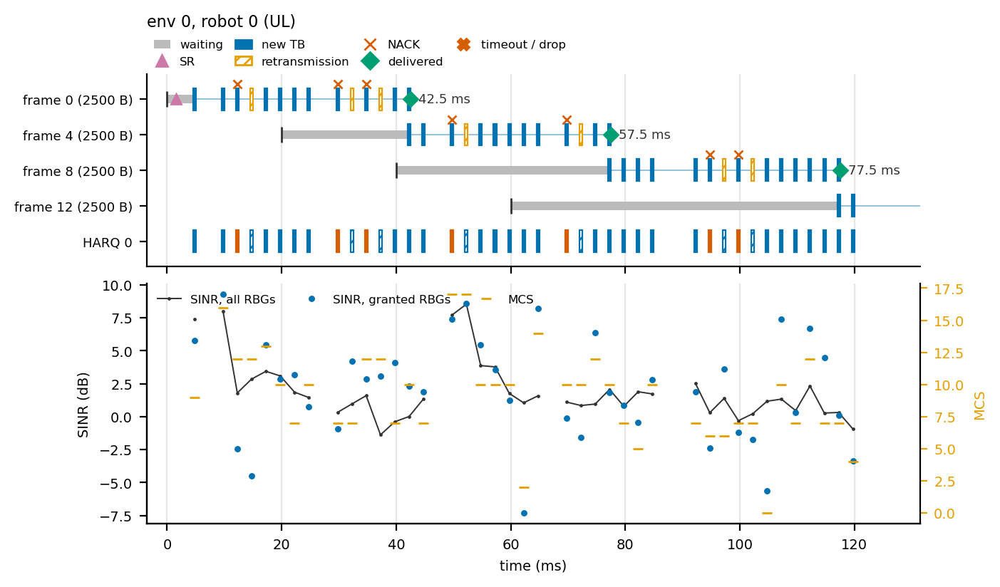
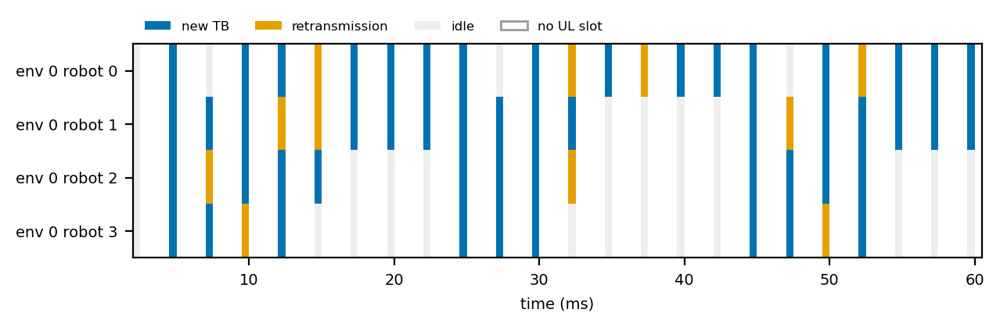

# Slot traces

The step dict tells you *that* a message took 40 ms. A slot trace tells you *why*. `SlotTrace` records, for a few robots you pick, every MAC event of the configurable NR engine `L2` slot by slot: when each frame arrived, when the robot asked for a grant, which transport blocks (TBs) carried its bytes, which of them failed and were retransmitted, and when the frame was delivered. `isaac_net.viz.trace` turns the record into a timeline figure.

```python
from isaac_net.core import NRConfig, Requests, make_engine
from isaac_net.core.trace import SlotTrace
from isaac_net.viz.trace import plot_slot_heatmap, plot_timeline

net = make_engine("L2", E, R, "cpu", NRConfig(dl=True))   # backend="reference" (the default)
trace = SlotTrace.attach(net, env=0, robots=[0, 3])      # or pairs=[(0, 0), (5, 2)]
for _ in range(50):
    net.submit(None, Requests(send))
    out = net.step(None, poses)

events = trace.to_frame()              # pandas DataFrame, one row per event (a list of dicts without pandas)
slots = trace.to_frame("samples")      # one row per (data slot, traced robot): SINR, MCS, queue bytes
trace.summary()                        # per robot: delay mean / p95, retransmissions per TB, grants per frame, ...
trace.save("run.parquet")              # Parquet with pyarrow, CSV otherwise; plus run.samples.* and run.meta.json
plot_timeline(trace, robot=0, path="timeline.png")
plot_slot_heatmap(trace, path="slots.pdf")
```

`attach` accepts the engine `make_engine` returns, or any wrapper of it (background users, edge loop, energy). Robot indices are the engine's rows, so with [background users](background-energy-sharding.md) rows `R` and above are the ghost UEs. `TraceTable.load(path)` reads saved files back, and every table, summary and plot works on the loaded object too.

## What is recorded

Each event row has the columns `run, episode, step, g, t_ms, env, robot, dir, event, frame, fidx, pid, ntx, mcs, n_rbg, n_prb, bytes, tbs, lo, hi, delay_ms, value`. `g` is the engine's global slot and `t_ms = g × slot_ms` the start of that slot, so the time axis is the engine clock, shared by all envs. `episode` counts the partial resets of the env since the trace started, and `run` counts full resets. A column that does not apply to an event is `-1` or NaN.

| `event` | When | Columns that carry data |
|:---|:---|:---|
| `arrival` | a frame enters the queue (at its arrival slot with traffic models) | `frame`, `fidx`, `bytes`, byte range `lo`–`hi` |
| `sr` | the robot sends a scheduling request | |
| `sr_grant` | the gNB acts on it: the lumped grant delay has passed, or the 5G-LENA bootstrap grant is owed | |
| `grant` | the robot is scheduled in this slot | `pid`, `ntx`, `mcs`, `n_rbg`, `n_prb` |
| `tb_new`, `tb_retx` | a new TB or a HARQ retransmission | `pid`, `ntx` (transmission number), `mcs`, `tbs` (bits), `bytes` (stream bytes it carries), `lo`–`hi`, `value` (SINR dB on the granted RBGs) |
| `ack`, `nack` | the decode result of that TB | `pid`, `ntx` |
| `rlc_retx`, `harq_drop` | HARQ gave up after `max_harq_tx`: RLC AM resends the bytes after `rlc_retx_slots`, RLC UM loses the frames | `pid`, `lo`–`hi` |
| `delivered` | the frame completed (RLC in-order delivery plus the processing offset) | `frame`, `fidx`, `delay_ms` (equal to the step dict's `delay`), `t_ms` = completion time |
| `timeout`, `dropped` | purged at its deadline, or lost under RLC UM | `frame`, `fidx` |
| `cqi` | a DL CQI report | `value` (the gNB's SINR estimate after the report, mean over RBGs, dB) |
| `tpc` | a closed-loop TPC command (`ul_tpc=True`) | `value` (dB) |
| `handover`, `rlf`, `rlf_end` | serving cell change, radio link failure and its end (several cells) | `value` (new cell) |
| `access`, `rach_preamble` | access state change (`rach` / `drx`), preambles sent in the step | `value` (0 idle, 1 RACH, 2 connected, 3 DRX-dormant; preamble count) |
| `reset` | the env was reset | |

A frame is identified by `frame`, a running number of the trace. `fidx` is its position in the queue at the step in which the event was recorded, the index of the `[E, R, F]` step outputs. `trace.frames()` joins each frame with the TBs that carried its bytes: a TB belongs to every frame whose byte range `lo`–`hi` overlaps the TB's, so a TB that finishes one frame and starts the next appears in both.

The samples table has one row per data slot of a direction and traced robot: `tx` (0 idle, 1 new TB, 2 retransmission), `sinr_db` (on the granted RBGs when the robot transmits, else the mean over all RBGs), `sinr_wb_db` (mean over all RBGs), `mcs`, `n_rbg`, `queue_bytes` (accepted bytes not yet delivered in order), `cell` and `access`. A UL SINR depends on the power spectral density of the robot's own grant, so UL samples carry a SINR only in slots in which the robot transmits. The SINR is the one the MAC decodes with, after the inter-cell interference and any user SINR hook.

`summary()` gives one row per traced robot: frames, deliveries, timeouts and drops; delay mean, median, 95th percentile and maximum; new TBs, retransmissions, retransmissions per TB and the NACK ratio; HARQ exhaustions; grants per frame and TBs per delivered frame; SRs; the mean SINR and MCS of the robot's transmissions; handovers and RLFs; and the time spent idle, in RACH and DRX-dormant, estimated from the access state at the robot's data slots.

## How it works, and what it costs

The trace only reads. Its hooks never write engine state or draw a random number, so the engine's outputs, counters and RNG streams are bitwise the same with and without it (`tests/test_trace.py` checks UL and UL + DL, one and three cells, partial resets, and traffic models with RACH, DRX and TPC). The hooks are:

* `MacLink.slot_hook`, called at the end of every `slot()` call (once per data slot, once per mini-slot occasion) with the slot's TB decisions and decode results. It is `None` unless a trace is attached.
* An observer on the per-slot SINR hook through `core/slot_tap.SlotTap`, which chains it with the energy and background taps. It samples the decoding SINR and the SR and TPC state between the slot's grant step and its decode.
* Instance wrappers on `ul.sr_step`, `dl.cqi_report`, `end_step` of each link (the frame masks before compaction, the same ones the step dict is built from) and `ul.reset`, as `NREngine` already wraps them for traffic models.

Each hook gathers the traced rows with one fixed index list and appends a small float64 tensor to a list on the engine's device. No hook calls `.item()` or copies to the host during the step. Every `flush_steps` control steps (32 by default), and whenever a table is read, the records go to the host in one transfer and are turned into events there. The cost is about 25 gathers of K rows per data slot, independent of E and R. On a CPU, at E = 64, R = 8 and two traced robots, a 100 ms control step took between 5 % and 20 % longer in our runs. `max_events` (default one million) caps the stored events plus samples; recording stops there and `trace.truncated` is set.

## Backends

`SlotTrace` needs `backend="reference"` (`"eager"` is the same engine) and refuses the others with a message:

* `graph` replays a captured CUDA graph, so the Python hooks would run once, at capture, and never again. A graph-safe variant that reads per-step state deltas could not recover per-slot events (several TBs, NACKs and grants happen within one step), so it is not offered. The reference backend is bitwise equal to `graph` with the same config and seed, so a trace taken on it shows exactly what `graph` computes.
* `triton` runs every slot of a control step in one fused kernel, which has no per-slot hook at all.

The other levels (`L0` to `L2-legacy`, surrogates, bounds) have no MAC to trace and are refused too.

## Reading a timeline: why did this message take 40 ms?



`scripts/trace_timeline.py` produced this figure. Four robots share one cell with the default `NRConfig` (TDD `DDDSU` at 0.5 ms slots, so one UL slot every 2.5 ms), each sends a 2500-byte message every 20 ms control step, and robot 0 sits at the cell edge at 5 dB SNR. The top panel has one lane per frame, oldest at the top. The gray bar is the time the frame waits for its first byte to go out, the triangle is an SR, each small bar is one TB that carried bytes of the frame (solid blue new, hatched orange retransmission, a red x above a TB that failed to decode), and the green diamond marks delivery with the delay next to it. The `HARQ` lanes show every TB of the robot on its HARQ process, blue for ACK and red for NACK. The bottom panel shows the SINR of the robot's transmissions (dots on the granted RBGs, line over all RBGs) and their MCS on the right axis. Light vertical lines mark the control-step boundaries.

Frame 0 took 42.5 ms, and the figure shows where the time went:

1. **Access, 4.5 ms.** The frame arrives at 0 ms with an empty buffer, so the robot first sends an SR at the next SR opportunity (1.5 ms). The grant takes `sr_delay` slots, and the first TB leaves in the next UL slot, at 4.5 ms.
2. **Small TBs, most of the rest.** At 5 dB the power-headroom cap allows the robot only one to three RBGs, at MCS 7 to 16, so each TB carries 90 to 390 bytes of the 2500. The robot shares the carrier with three other robots, but they need few RBGs, so it is scheduled in most UL slots. Fourteen transmissions in the sixteen UL slots from 4.5 ms to 42 ms carry the frame.
3. **Retransmissions, 7.5 ms.** Three of the fourteen TBs fail (red x) and are resent `ul_rtt` slots later, each adding one more UL slot that carries no new bytes.

Frames 4 and 8 take 57.5 ms and 77.5 ms for a different reason: they arrive while the robot is still sending frame 0 (or 4), and the long gray bars show them waiting behind it in the FIFO. The robot offers 125 kB/s but drains less than that at its cell-edge rate, so the backlog grows by 15 to 20 ms per frame. The same figure for robot 3 (18 dB) shows short gray bars and three or four TBs per frame, delivered within the control step. In tables, `trace.summary()` gives the same picture as numbers: robot 0 has the highest retransmissions per TB and grants per frame, and `trace.frames()` lists the TBs of each frame.

`plot_slot_heatmap` shows the traced robots against the slots: who transmitted new data, who retransmitted, who was idle, and which slots carry no UL data. It shows at a glance how the scheduler shares the UL slots and when a robot is starved.



## Tests

`tests/test_trace.py`: bitwise invisibility on `L2` reference (UL, UL + DL, one and three cells, partial resets; traffic models with RACH, DRX and TPC); every delivered frame of the step dict has an arrival, at least one TB and a delivered event, with the delay equal to the step's `delay`; with every robot traced, the TB, retransmission, ACK and NACK counts equal `counters()["ul"]`; every TB has a grant in its slot; refusal of the graph and triton backends and of the other levels; `max_events` and `detach`; DataFrame, CSV and Parquet round trips; `plot_timeline` and `plot_slot_heatmap` render with the Agg backend, and the slot map has one row per traced robot.
