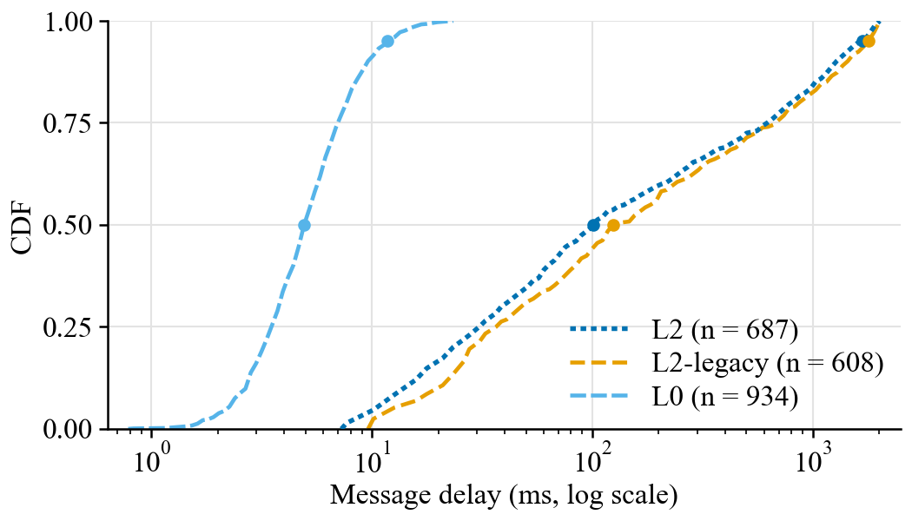
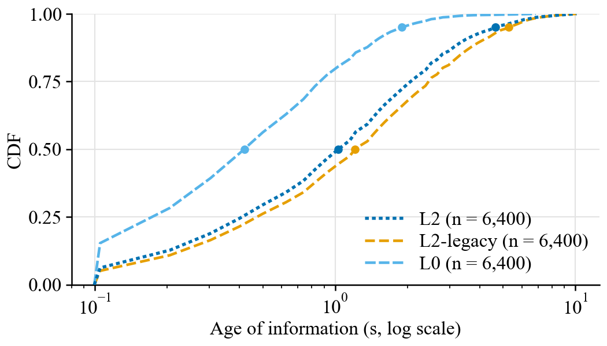
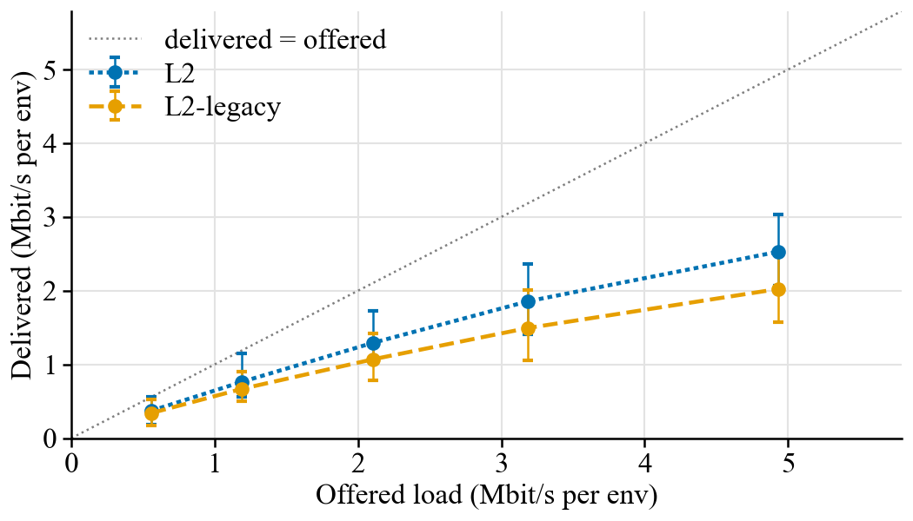
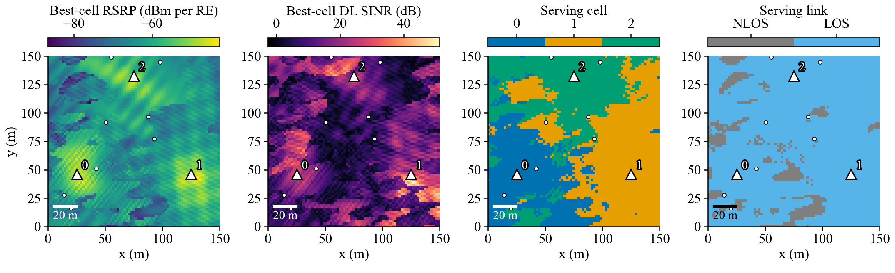
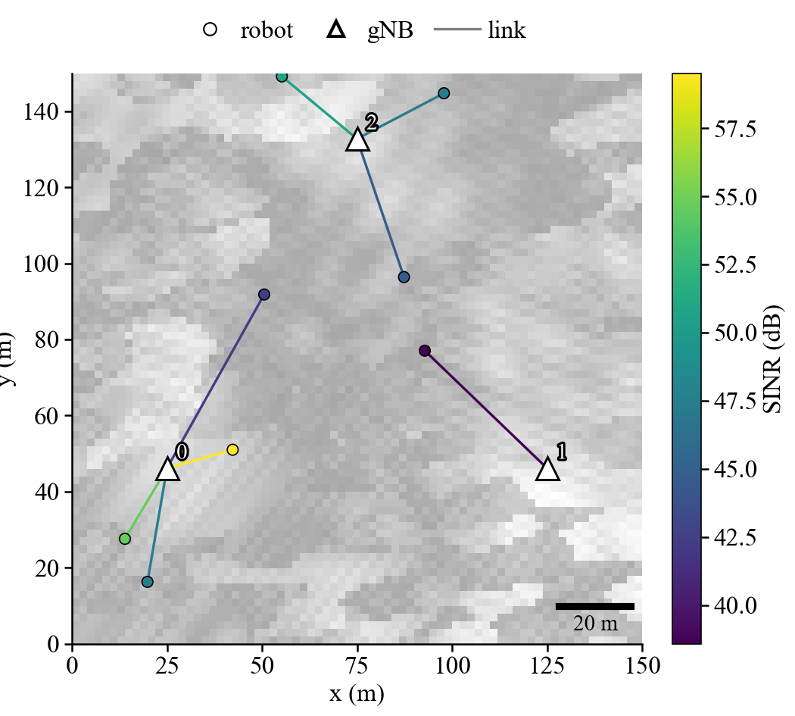
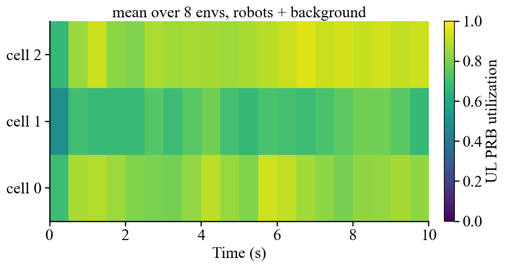
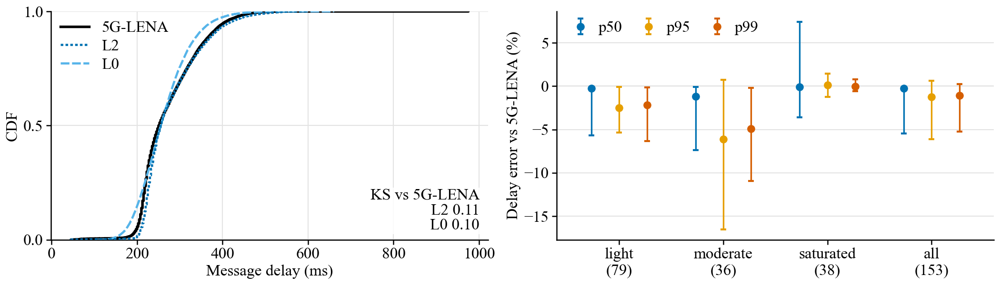

# Plots and reports

`isaac_net.viz` turns engine runs, benchmark results and the fidelity study's tables into figures in the paper's style, and `RecorderLoop` (`isaac_net/core/record.py`) records the per-step KPIs those figures need. Both live behind the optional `viz` extra. The core package imports neither matplotlib nor pandas.

```bash
pip install "isaac-net[viz]"          # matplotlib, pandas, pyarrow
```

Every image on this page comes from `python docs/img/viz/make_gallery.py`, which runs small seeded CPU jobs in about 30 seconds.

## Record a run

```python
from isaac_net import make_engine, record
from isaac_net.viz import cdf, report

net = record(make_engine("L2", E, R, dev, cfg), "runs/l2", every=10, label="L2 default")
for _ in range(T):
    net.submit(None, send)
    out = net.step(None, pos)              # the engine's own step dict, unchanged
net.close()                                # writes what is still buffered; `with record(...) as net:` also works
cdf.plot_delay_cdf(["runs/l2", "runs/l0"], by="level", path="delay.png")
report.from_records(["runs/l2", "runs/l0"], "report.html")
```

`record(engine, out_dir, **kw)` is `RecorderLoop(engine, RecordConfig(out_dir=out_dir, **kw))`. It wraps any engine from `make_engine`, including `EdgeLoop`, `BackgroundLoop` and `EnergyLoop`, in the same way `EnergyLoop` does. The engine API and the step dict stay the same. It is an explicit wrapper rather than an `NRConfig` field, so `make_engine` builds exactly what it built before. Wrap the outermost engine to see every key that the inner wrappers add (`energy_*`, `bg_*`).

**The recorder does not change the run.** It draws no random numbers and writes into no engine tensor, so every step output is bitwise the same as the bare engine's. `tests/test_record.py` checks this on L2 with multi-cell, background users, energy, RACH and DRX, and on L2-legacy and L0, with partial resets. Per step it only adds into fixed-shape device accumulators and makes no host sync (the test forbids `item`, `tolist`, `cpu`, `numpy` and the scalar conversions during the recorder's step). Every `every` steps it closes a window and stores one row per env in a device buffer of `flush_every` windows. Only a flush (buffer full, `flush()` or `close()`) copies data to the host and writes files. On a CPU, recording L2 with 64 envs of 16 robots adds about 3% to the step time.

| `RecordConfig` field | Default | Meaning |
|:---|:---|:---|
| `out_dir` | `"records"` | directory of the tables and `meta.json` |
| `every` | 1 | control steps per row |
| `flush_every` | 256 | windows kept on the device between host writes |
| `format` | `"auto"` | Parquet with pyarrow, else CSV; or `"parquet"`, `"csv"` |
| `per_cell` | True | write the `cells` table |
| `raw_envs` | `()` | env ids whose robots get a row per window (`robots` table) |
| `hist` | True | write the delay and AoI histograms (exact CDFs to within one bin) |
| `label` | `""` | run name, a column of every table; `by="config"` groups runs by it |
| `level` | None | level name for the `level` column; None = the wrapped engine's level |
| `tensorboard` | None | log directory for `torch.utils.tensorboard` (needs the tensorboard package) |
| `wandb` | False | True logs to the active Weights & Biases run (one is started if none), or a dict of `wandb.init` arguments |
| `log_every` | 1 | scalar logging cadence in control steps |

TensorBoard and W&B receive the env mean of `delivered`, `lost`, `delay_mean_ms`, `delay_p50_ms`, `delay_p95_ms`, `aoi_p95_s`, `queue_bytes`, `prb_util`, `harq_bler` and `energy_j` under `net/`, for every window whose end step is a multiple of `log_every`. They are written at flush time, so logging adds no sync either.

### Tables

Each table is a directory of Parquet parts (`out_dir/steps/part-00000.parquet`, ...) or one CSV file (`out_dir/steps.csv`). `isaac_net.core.record.read_records(out_dir, table)` reads either as a pandas DataFrame, and `meta.json` holds the schema version (`isaac-net-record/1`), sizes, the control step length, the configuration summary and the column lists. Every table ends with the constant columns `label` and `level`. A column that the engine does not produce is NaN, so the schema is the same on every level.

| Table | One row per | Columns |
|:---|:---|:---|
| `steps` | window and env | `step` (control steps since the recorder was created, at the window end), `env`, `episode` (resets of the env since recording began), `t` (env clock), `steps` (window length); sums over the window: `sent` (accepted messages), `offered_bytes`, `delivered`, `delivered_bytes`, `lost` (timed out or dropped), `harq_tx`, `harq_retx`, `energy_j`; `delay_mean_ms`, `delay_p50_ms`, `delay_p95_ms` over the messages delivered in the window; `aoi_mean_s`, `aoi_p95_s`; window means of `queue_bytes`, `queue_len`, `sinr_mean_db`, `access_idle` / `access_rach` / `access_connected` / `access_dormant` (robot shares), `los_frac`, `blocked_frac`, `bg_util`; `prb_util` and `dl_prb_util` (PRB-slots granted over available, L2); `harq_bler` (first transmission); `battery_frac` (at the window end) |
| `cells` | window, env and cell | `robots` served at the end, `delivered`, `prb_util` (the robots' PRB-slots in the cell over the cell's available PRB-slots, L2), `bg_util`, `bg_n` |
| `robots` | window, env in `raw_envs` and robot | `x`, `y` (when `step` gets poses), `sinr_db`, `serving_cell`, `queue_bytes`, `queue_len`, `access_state`, `los`, `blocked`, `battery_frac`, `aoi_s` at the end; `delivered`, `lost`, `delay_mean_ms`, `energy_j` over the window |
| `delay_hist`, `aoi_hist` | flush, env and non-empty bin | `bin`, `lo_ms`, `hi_ms`, `count`: log-spaced bins from 0.1 ms to 60 s, about 6% wide (the bins of the benchmark metrics) |

Delay is capture to delivery, the engine's `delay` times the control step. Age of information is computed per robot as in the Isaac layer's `NetModule`: the newest delivered capture, with the state at reset counting as known. The env-level `prb_util` counts every UE the NR MAC schedules, background ghosts included, while the per-cell `prb_util` counts the robots only and `bg_util` gives the background share. The PRB, HARQ and per-cell counters come from the NR engine (level `L2`). The per-cell PRBs use the read-only slot tap that `EnergyLoop` also uses (`core/slot_tap.py`).

## Gallery

### Delay and AoI CDFs

`cdf.plot_delay_cdf(data, by="level")` and `cdf.plot_aoi_cdf(...)` draw one curve per level (`by="level"`) or per run label (`by="config"`), with dots at p50 and p95. The input can be recorder directories (their histograms give the CDF to within one bin), a frame table with a `delay_ms` column grouped by a column such as `arm`, or a dict of samples in ms. Below, the same random traffic runs on L2, L2-legacy and L0 (8 envs × 8 robots, 100 steps).





### Throughput vs load

`loads.plot_throughput_vs_load(data, by="level")` plots the delivered against the offered rate per env. Recorder directories give one point per run (mean over envs, whiskers from the 10th to the 90th percentile over envs), so a sweep over loads traces a curve. Benchmark result directories and tables with `offered_mbps` and `delivered_mbps` columns work too.



### Radio environment map

`maps.plot_rem(rem, robots=None, panels=("rsrp", "sinr", "serving", "los"))` takes the `.npz` file or dict from `isaac_net.tools.rem` and draws one panel per name, with the gNBs, an optional robot overlay and a scale bar. `pathgain` is also available, and `los` (the serving link's LOS state) needs a channel with a LOS state. `isaac-net-rem --png rem.png --panels rsrp,sinr,serving,los` uses the same function. Below are three cells with the TR 38.901 UMi channel at 2 m resolution.



### Arena snapshot

`maps.plot_arena(positions, links, blocked, sinr, gnb)` draws one env from above. Robots and their links to the serving gNB are coloured by SINR, blocked links are dashed, and a REM can be drawn faintly underneath (`rem=`). `links` takes the step dict's `serving_cell`, `blocked` takes `out["blocked"]` (the obstacle stack), and `gnb` takes positions or an `NRConfig`.



### Per-cell PRB utilization

`loads.plot_cell_utilization(record_dir)` draws a cells × time heatmap from the `cells` table, either the mean over envs or one env (`env=`). The robots' and the background users' shares are added unless `include_background=False`. The run below has three cells with three background users per cell, recorded every five steps.



### Engine vs ns-3 5G-LENA

`compare.plot_vs_ns3(engine_csv, lena_csv=None, per_run_csv=...)` overlays the engine's delay CDF on 5G-LENA's and prints the KS distance of each arm. Frame tables have a `delay_ms` column, and one table with an `arm` column (such as `benchmarks/results/closedloop/frames.csv.gz`) is split into the ns-3 arm and the engine arms. A per-run table of the fidelity study (`benchmarks/fidelity/results/*/per_run_<arm>.csv`) adds the per-run errors of p50, p95 and p99: the median by load regime and over all runs, with whiskers from the 25th to the 75th percentile. Below, the left panel is the closed-loop run of [closed-loop.md](closed-loop.md) and the right panel is `lena_validation_v2()` over the 153 runs of [fidelity-vs-lena.md](fidelity-vs-lena.md).



## Reports

- `isaac_net.viz.report.from_records(dirs, "report.html")` writes a self-contained HTML page with inline PNGs. It contains a summary row per run (delivered messages per env-second, loss, delay p50 and p95, AoI p95, PRB utilization, BLER, energy), the delay and AoI CDFs, throughput, and every run's per-cell heatmap. `dirs` can be a list of recorder directories or one parent directory.
- `isaac-net-bench report results/ --html report.html` adds the same kind of page to the benchmark suite: the Markdown table as HTML, the task metric of every configuration (mean ± 95% CI), a per-configuration table, and CDFs of the per-episode delay p95 and mean AoI per baseline for every task configuration. `--figures DIR` writes these figures as PNGs and lists them under the Markdown table. The CDFs run over the evaluation env-episodes when the result files keep their rows (`isaac-net-bench run --keep_rows`), and over the seeds otherwise.

## Style

`style.use_paper_style()` applies the rcParams of the paper's figures globally: Times (falling back to STIX), 8 pt text, thin axes and no top or right spines. Every plot function also applies them locally (`style.paper_style()`), so package plots match the paper without changing the caller's settings. Colours follow the paper: L2 blue, L2-legacy orange, L1 purple, L0 sky blue, ns-3 5G-LENA black and Isaac Lab physics green, with the other Okabe-Ito colours for any other group (`style.color_for`, `style.styles_for`). `style.COL_W` and `style.TEXT_W` are the IEEE column and text widths. Every function returns its Axes (an array for multi-panel figures), saves the figure when `path=` is given, and accepts `ax=` (or `axes=`) to draw into an existing figure.
